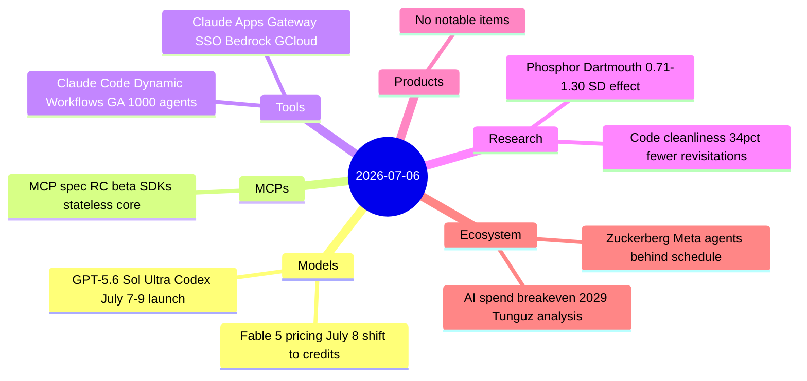
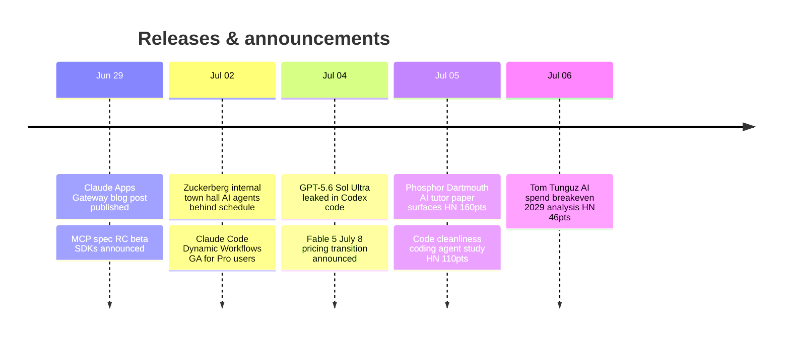

# AI Digest — 2026-07-06

> A Sunday digest with nine substantive items across a quiet news cycle. The forward-looking headline is OpenAI's targeted July 7–9 window for a broader GPT-5.6 rollout — Sol Ultra surfaced in Codex code, positioned to match Fable 5 performance at lower cost, and timed against the White House voluntary frontier model standards expected tomorrow. The most discussed story of the past 48 hours is Mark Zuckerberg's admission to Meta staff that agent development is running behind schedule, pinning the bottleneck on systems engineering (memory, tool reliability, long-horizon planning) rather than base model quality. Two empirical studies add concrete data: clean code reduces agent token consumption 7–8% and file revisitations 34%, and Dartmouth's Phosphor AI tutor produced 0.71–1.30 SD exam gains — with the usual caveats about selection bias in observational data.

## Day at a glance

## Top stories

1. **GPT-5.6 Sol Ultra leaked in Codex; broader launch targeted July 7–9** — Code discovery shows OpenAI preparing a Sol Ultra tier aimed at matching Fable 5 performance, with an internal launch window aligned to the White House voluntary frontier model standards announcement expected tomorrow. [→ details](models.md#gpt-56-sol-ultra)
2. **Zuckerberg: Meta's AI agents are behind schedule** — At a July 2 town hall, Zuckerberg told employees that agentic progress hadn't materialized as planned despite $145B capex and a major workforce restructuring; the bottleneck is systems engineering, not base model quality. [→ details](ecosystem.md#zuckerberg-meta-agents-slow)
3. **Claude Apps Gateway + Dynamic Workflows GA** — Two Anthropic tooling releases that weren't caught in earlier digests: a self-hosted SSO/spend-control gateway for Claude Code on Bedrock and Google Cloud, and general availability of 1,000-parallel-agent workflows for Pro subscribers. [→ details](tools.md#claude-apps-gateway)

## By the numbers

| Category   | Items | Highlight |
|------------|------:|-----------|
| Models     |     2 | GPT-5.6 Sol Ultra: Terminal-Bench 2.1 91.9%, targeted July 7–9 |
| MCPs       |     1 | MCP July 28 RC: stateless core, round-robin LB, Tasks extension |
| Tools      |     2 | Claude Apps Gateway: SSO + spend caps for Claude Code on Bedrock/GCloud |
| Research   |     2 | Code cleanliness: 34% fewer agent file revisitations; 7–8% fewer tokens |
| Products   |     0 | — |
| Ecosystem  |     2 | Zuckerberg: agents behind schedule; AI spend base case 140% of salary by 2029 |

## Timeline (UTC)

## Files
- [Models](models.md)
- [MCPs](mcps.md)
- [Tools](tools.md)
- [Research](research.md)
- [Products](products.md)
- [Ecosystem](ecosystem.md)
