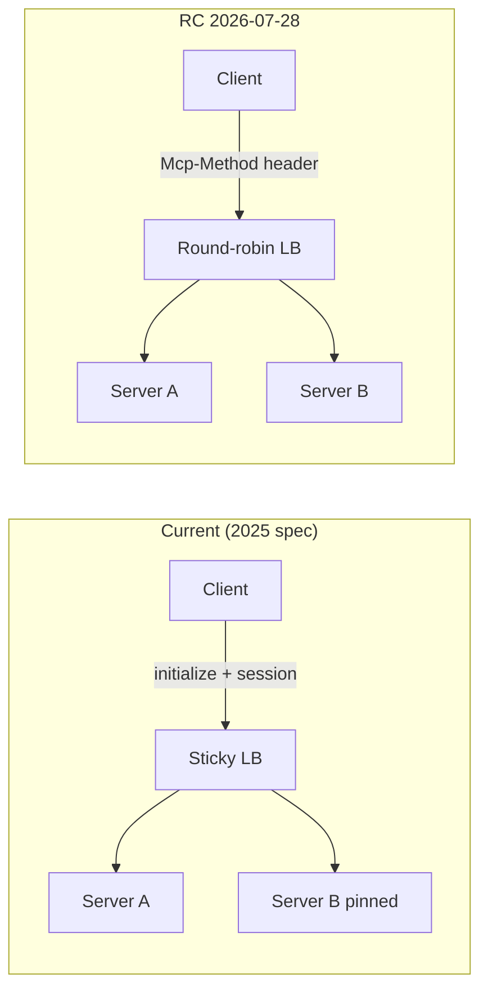

# MCPs — 2026-07-06

## MCP Spec July 28 Release Candidate: Beta SDKs Now Available 

**Source:** [MCP Blog](https://blog.modelcontextprotocol.io/) · **Type:** update · **Time (UTC):** June 29, 2026

The Model Context Protocol team published beta SDK support for the upcoming **2026-07-28 release candidate** — the largest protocol revision since MCP launched. The headline architectural change is a **stateless core**: the current `initialize` handshake and protocol-level session are eliminated, meaning a remote MCP server can now run behind a plain round-robin load balancer without sticky sessions or a shared session store. Traffic routing can be done on an `Mcp-Method` header, and clients are permitted to cache `tools/list` responses for a server-specified `ttlMs`. Additional extensions in this RC include:

- **MCP Apps**: Servers can ship interactive HTML interfaces rendered in a sandboxed iframe by the host; UI templates are declared ahead of time for host-side caching and security review before anything executes.
- **Tasks extension**: `tools/call` can now return a task handle instead of an immediate result; clients drive the task with `tasks/get`, `tasks/update`, and `tasks/cancel`.
- **Authorization alignment**: Tighter alignment with OAuth and OpenID Connect deployment patterns.

A formal deprecation policy ships alongside the RC, providing a forward-compatibility guarantee as the protocol continues to evolve.

**Why it matters:** The stateless shift is the operationally significant change: most current production MCP deployments require either a sticky load balancer or an external session store, both of which add cost and fragility. Eliminating that dependency makes MCP servers far simpler to deploy on commodity cloud infrastructure. The Tasks extension closes the biggest gap for agentic use cases — long-running tool calls that currently require polling workarounds.

---
