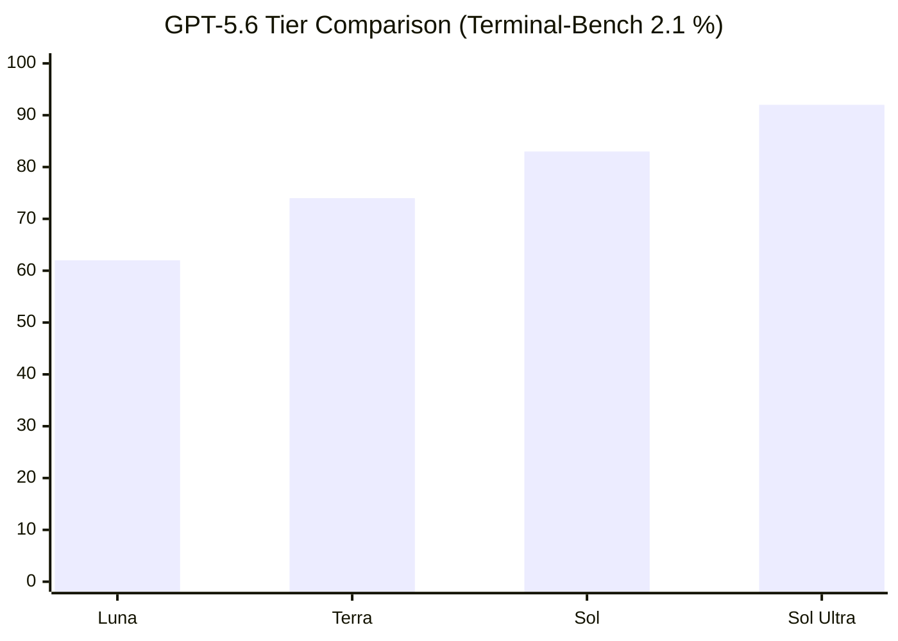

# Models — 2026-07-06

## GPT-5.6 Sol Ultra Surfaces in Codex; Broad Launch Targeted July 7–9 

**Source:** [BigGo Finance](https://finance.biggo.com/news/72d2cb81-4820-44a1-ab20-cfb53c7bf3db) · [ExplainX](https://explainx.ai/blog/gpt-5-6-release-date-features-benchmarks-2026) · **Type:** update · **Time (UTC):** July 4–5, 2026

Internal Codex application code discovered on July 4 reveals identifiers for a new GPT-5.6 sub-tier called **Sol Ultra**, alongside a "speed dial" feature for trading inference speed against answer quality. Backend routes for the model are currently inactive, suggesting it has not been deployed yet. Industry sources indicate OpenAI has internally targeted a **July 7–9 window** for the first broader rollout, timed to coincide with the White House voluntary frontier model standards announcement expected July 7. Sol Ultra's design goal, per the leaked identifiers, is to match Anthropic's Fable 5 on performance benchmarks while offering more accessible pricing than the existing Sol tier ($5/$30 per MTok). Terminal-Bench 2.1 figures circulating in enterprise previews show Sol Ultra at **91.9%**, above the existing Sol score. Real-time voice support is not included in this release.

**Why it matters:** The broader GPT-5.6 rollout has been gated since June 26 to approximately 20 government-vetted organizations; Sol Ultra in Codex would represent the first significant public access expansion. If the July 7 White House standards framework materializes as expected, it would mean OpenAI's scaling of access is explicitly tied to that policy milestone — a novel precedent for frontier model distribution.

---

## Fable 5 Subscription Inclusion Ends July 8 

**Source:** [AI Weekly](https://aiweekly.co/alerts/white-house-nears-voluntary-frontier-model-deal-with-top-ai-labs) · [AI Search](https://llm-stats.com/llm-updates) · **Type:** update · **Time (UTC):** —

Fable 5 is currently included at no additional cost on Claude Pro, Max, Team, and select Enterprise plans for up to 50% of a user's weekly usage limit — a term in place since the model was restored globally on July 1 following the export ban lift. Starting **July 8**, that inclusion ends: Fable 5 access will require usage credits billed at the standard API rate of **$10 per million input tokens and $50 per million output tokens**. Users on subscription plans who have been stress-testing Fable 5 in the window between restoration and the pricing transition have roughly 48 hours remaining before costs apply.

**Why it matters:** The July 1–8 window was effectively a free evaluation period for enterprise teams assessing Fable 5 against GPT-5.6 Sol ahead of contract decisions. Teams that have not already built Fable 5 into production workflows will face a step-change in cost structure. The $10/$50 pricing is higher than Claude Opus 4.8 ($7.50/$37.50 per MTok) and reflects Fable 5's higher compute cost at scale.

| Plan | Access through Jul 7 | From Jul 8 |
|------|---------------------|------------|
| Pro / Max / Team | Included (up to 50% weekly limit) | Usage credits required |
| Enterprise | Select plans included | Negotiated rate or usage credits |
| API | $10/$50 per MTok | No change |

---
