# Research — 2026-07-06

## Phosphor AI Tutor: 0.71–1.30 SD Effect Size in Live Dartmouth Course 

**Source:** [Utrecht InTextBooks Workshop 2026](https://intextbooks.science.uu.nl/workshop2026/files/itb26_s1s2.pdf) · [Hacker News](https://news.ycombinator.com/item?id=48796817) (160 pts) · **Type:** paper · **Time (UTC):** July 5–6, 2026

Researchers report a **0.71–1.30 standard deviation** improvement in exam performance for students with full engagement in **Phosphor** (formerly Spongium), an AI-graded practice quiz platform deployed in a Dartmouth statistics course (MATH 010) during Spring 2026. 143 students enrolled; approximately 90% voluntarily adopted the platform; 16 students (~11%) achieved "full engagement" as defined by the study. Phosphor is not a conversational tutor: it generates practice questions and grades constructed-response answers using Claude Sonnet against instructor-defined rubrics, producing immediate, rubric-grounded feedback.

Key methodological notes from the HN discussion:
- **No randomized control group** — the authors acknowledge this as a limitation.
- The effect size is measured for the "full engagement" cohort, which is likely self-selected for motivation. HN commenters flagged that motivated students who do more practice will naturally score higher regardless of platform.
- The dosage–performance relationship reportedly holds across the full usage distribution (not just the top engagers), per author clarification in the thread.
- Exam questions partially overlap with platform practice material, though the degree of overlap was not fully disclosed.

**Why it matters:** Despite the methodological caveats, the magnitude of the effect — if it survives a controlled replication — would be among the largest documented for any educational intervention. For engineers building AI tutoring products, the more immediately useful finding is the adoption rate: 90% voluntary use in a college course is unusually high and suggests LLM-graded practice problems have substantially lower friction than prior AI tutoring tools.

---

## Code Cleanliness Cuts Agent Token Use 7–8%, File Revisitations 34% 

**Source:** [arXiv 2605.20049](https://arxiv.org/abs/2605.20049) · [Hacker News](https://news.ycombinator.com/) (110 pts) · **Type:** paper · **Time (UTC):** July 5–6, 2026

SonarSource researchers ran a controlled minimal-pair study to test whether code quality affects AI coding agent performance. They created 33 tasks across six repository pairs — structurally identical codebases that differ only in cleanliness metrics — and evaluated agents across 660 trials using Claude Code.

Key findings:
- **Task completion rate**: No statistically significant difference between clean and messy codebases. Agents successfully complete the same tasks regardless of code quality.
- **Token efficiency**: Agents working on cleaner code use **7–8% fewer tokens** on average.
- **File revisitations**: Agents working on cleaner code revisit files **34% less often**, suggesting that messy code causes more back-and-forth navigation before changes are confident.

The degradation methodology is important: the authors worked in both directions (degrading clean repos and cleaning messy ones) to rule out confounds. All repository pairs were drawn from real open-source projects, not synthetic code.

**Why it matters:** The result decouples correctness from efficiency: if you care only about whether the agent finishes the task, code cleanliness doesn't matter. But at scale — where 34% more file reads directly multiplies token costs — investing in code quality has measurable economic value for teams running agentic workflows. The finding also gives a concrete justification for enforcing linting and formatting standards even in codebases that humans rarely read.

```mermaid
xychart-beta
  title "Coding Agent Behavior: Clean vs Messy Code"
  x-axis ["Token Use", "File Revisitations"]
  y-axis 0 --> 100
  bar [92, 66]
  bar [100, 100]
```

> *Values normalized to messy code = 100. Blue = clean, brown = messy.*

---
