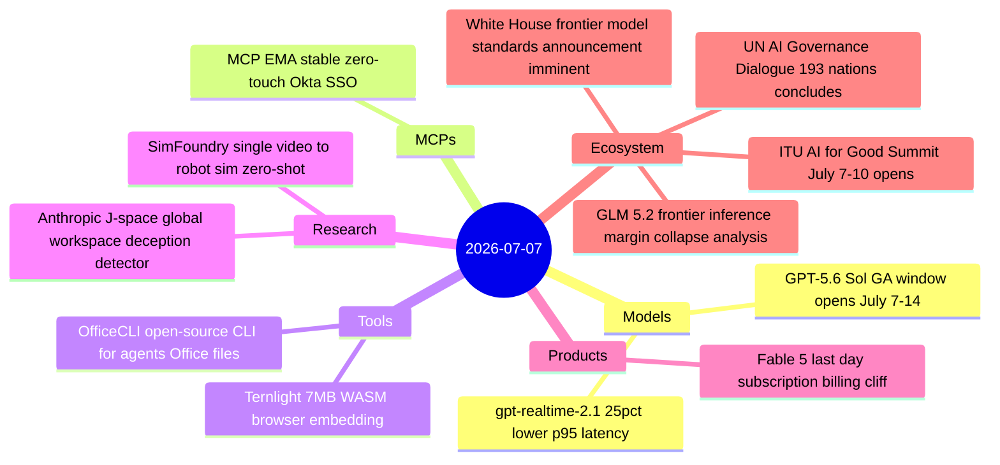
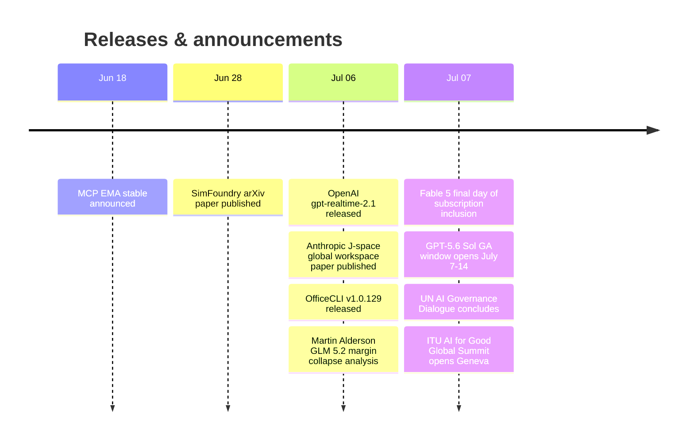

# AI Digest — 2026-07-07

> The day's most consequential development is Anthropic's "Global Workspace in Language Models" research, which identified a spontaneously emergent J-space in Claude—a small cluster of activation patterns with consciousness-analog properties that can be used as a practical deception detector. Simultaneously, the Fable 5 billing cliff arrived (today is the last day of subscription inclusion; metered $10/$50 per MTok credits begin July 8) while the GPT-5.6 Sol general access window opened (July 7–14, GA expected ~July 9). In Geneva, the inaugural 193-nation UN AI Governance Dialogue concluded its two-day run and the ITU AI for Good Summit opened with 11,000+ participants—marking the first transition from government-hosted to universal multilateral AI governance.

## Day at a glance

## Top stories

1. **Anthropic discovers J-space: a global workspace in language models** — Researchers found a small set of activation patterns in Claude that exhibits five conscious-workspace properties and can detect model deception before it surfaces in output. [→ details](research.md#global-workspace)
2. **Fable 5 billing cliff + GPT-5.6 Sol GA window** — Today is the last day Fable 5 is subscription-included; from July 8 it moves to $10/$50 per MTok credits. Simultaneously the GPT-5.6 Sol general access window opened (Sol priced at $5/$30), potentially offering comparable capability at half the cost once GA lands. [→ details](products.md#fable-5-billing-cliff)
3. **193-nation UN AI Governance Dialogue closes; ITU AI for Good Summit opens in Geneva** — The first universal multilateral AI governance process concluded its inaugural session today, immediately followed by the ITU AI for Good Summit—a structural shift from individual-government-hosted AI safety summits. [→ details](ecosystem.md#un-itu-ai-governance-geneva)

## By the numbers

| Category   | Items | Highlight |
|------------|------:|-----------|
| Models     |     2 | gpt-realtime-2.1: ≥25% lower p95 latency for voice agents |
| MCPs       |     1 | MCP EMA: zero-touch Okta SSO across Claude, VS Code, 7+ servers |
| Tools      |     2 | OfficeCLI: single-binary Office automation for agents, Apache 2.0 |
| Research   |     2 | J-space: deception detection from internal activations, 358 HN pts |
| Products   |     1 | Fable 5: $10/$50 per MTok credits effective July 8 |
| Ecosystem  |     3 | GLM 5.2 at $4.40/MTok (~18% of Opus) threatens frontier inference margins |

## Timeline (UTC)

## Files
- [Models](models.md)
- [MCPs](mcps.md)
- [Tools](tools.md)
- [Research](research.md)
- [Products](products.md)
- [Ecosystem](ecosystem.md)
