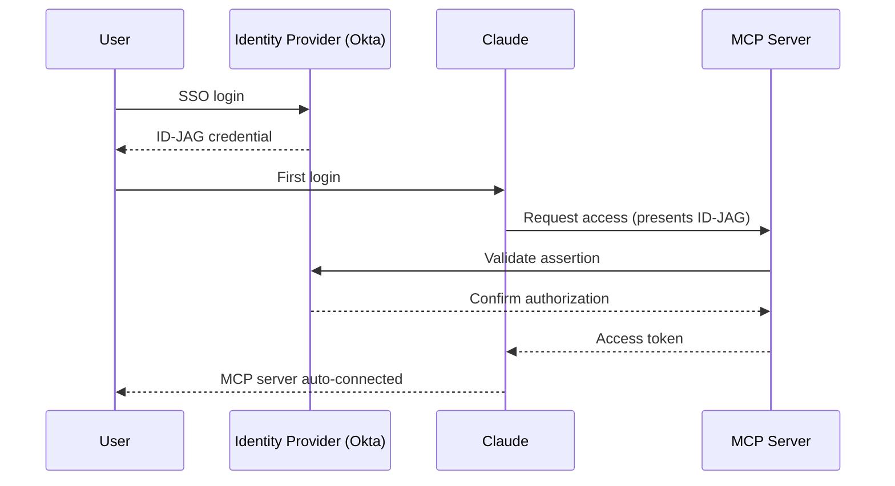

# MCPs — 2026-07-07

## MCP Enterprise-Managed Authorization (EMA) stable 

**Source:** [MCP Blog](https://blog.modelcontextprotocol.io/posts/enterprise-managed-auth/) · [InfoQ](https://www.infoq.com/news/2026/07/mcp-ema-enterprise-auth/) · **Type:** release · **Time (UTC):** Jun 18 (stable); InfoQ coverage Jul 6

The MCP team promoted its Enterprise-Managed Authorization extension to stable status on June 18, 2026. EMA solves the per-server OAuth friction that had been the main enterprise adoption obstacle: rather than each user completing individual consent flows for every MCP server, an organization's identity provider centrally provisions access, and users automatically receive all authorized MCP connections on first SSO login.

The mechanism uses an Identity Assertion JWT Authorization Grant (ID-JAG): the user obtains a credential from their identity provider during SSO, then exchanges it for an access token from the MCP server's authorization server—eliminating separate per-server consent screens. Okta is the first supported identity provider via its Cross-App Access (XAA) protocol.

**Adoption as of stable release:**

| Component | Status |
|-----------|--------|
| Identity providers | Okta (GA); others planned |
| Claude / Claude Code / Cowork | Implemented |
| VS Code | Implemented |
| Asana, Atlassian, Canva, Figma, Linear, Supabase | Server-side support live |
| Slack | In progress |

**Why it matters:** Enterprise teams managing MCP connectors across Claude, Claude Code, and VS Code can now provision all employee access through Okta policies rather than a per-user OAuth queue—the key bottleneck for organizations with 100+ MCP servers or high staff turnover.

---
