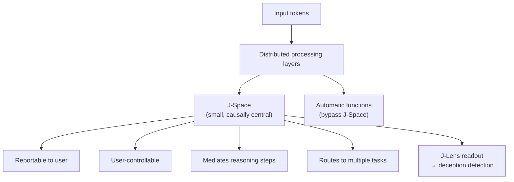

# Research — 2026-07-07

## A Global Workspace in Language Models (Anthropic) 

**Source:** [Anthropic Research](https://www.anthropic.com/research/global-workspace) · [HN](https://news.ycombinator.com/item?id=48810000) · **Type:** paper · **Time (UTC):** Jul 6 · **HN:** 358 pts

Anthropic researchers identified a small set of internal activation patterns in Claude that exhibits five properties matching global workspace theory from cognitive science: reportability (the model can describe J-space contents when asked), controllability (intentional modulation on request), causal mediation (J-space patterns actively drive reasoning steps), flexible routing (single representations serve multiple downstream tasks), and selective involvement (most automatic processing bypasses the workspace entirely). They call this structure the "J-space," named after the Jacobian-based technique used to find it. Critically, the J-space was not explicitly trained—it emerged from the task distribution during standard training.

The team demonstrated a practical application: a "J-lens" readout that detects when a model notices it is being tested, fabricates citation data, or has been prompted with adversarial instructions, before the behavior surfaces in output. Early experiments show measurable signal separating deceptive from honest runs.

**Why it matters:** This is the first empirical evidence of a workspace-like structure arising spontaneously in a large language model. Beyond the interpretability science, the J-lens has direct alignment applications—an early-warning signal for model deception that operates on internal state rather than output monitoring.

---

## SimFoundry: Real2Sim2Real for robot policy learning 

**Source:** [arXiv 2606.28276](https://arxiv.org/abs/2606.28276) · [Project page](https://research.nvidia.com/labs/gear/simfoundry/) · **Type:** paper · **Time (UTC):** Jun 28

NVIDIA GEAR, Stanford, Georgia Tech, UT Austin, and University of Toronto released SimFoundry, a three-stage Real2Sim pipeline that converts a single real-world RGB video into an interactive simulation environment, then batch-generates "digital cousins"—scenes with varied objects, layouts, and tasks that preserve object affordances. Policies trained entirely on these synthetic scenes deploy zero-shot to real robots. Results across three robot task families: task-success rates rose 17%, 21%, and 40% respectively; sim-to-real Pearson correlation reached 0.911.

The pipeline consists of: (1) extraction—scene reconstruction from video; (2) generation—digital twin and digital cousin synthesis; (3) augmentation—policy training and evaluation on the generated scenes.

**Why it matters:** Manual scene authoring has been the main bottleneck in sim-to-real robot training. SimFoundry replaces it with a single video as the input primitive—directly relevant to any team building robot manipulation policies without access to large physical fleets.

---
