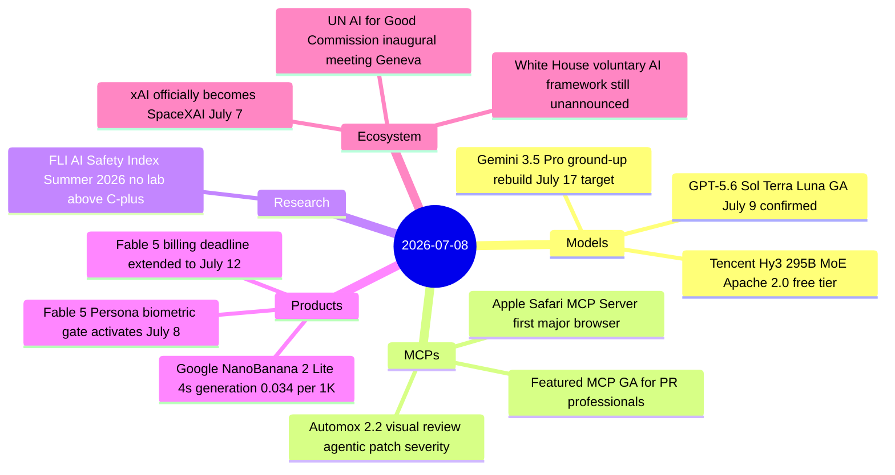
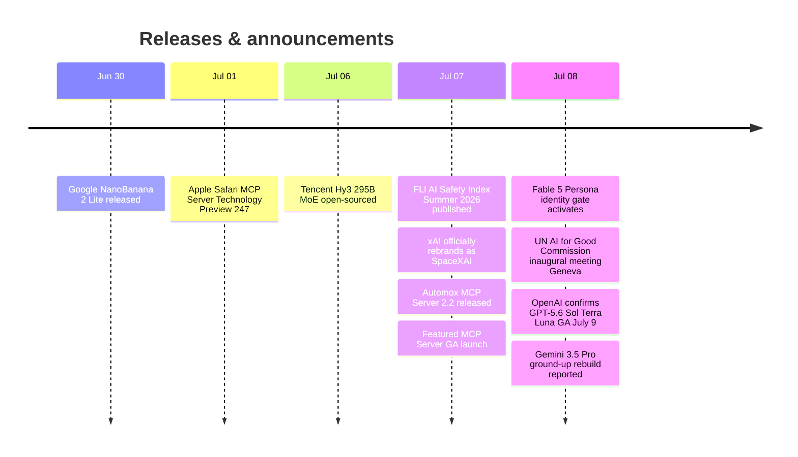

# AI Digest — 2026-07-08

> Today marks the eve of OpenAI's full GPT-5.6 family launch—Sol, Terra, and Luna all go generally available on July 9 after the U.S. Commerce Department cleared the release—while Anthropic activated a Persona biometric identity-verification gate for consumer Fable 5 access and quietly extended the billing deadline to July 12. Google confirmed a ground-up architectural rebuild of Gemini 3.5 Pro with an unconfirmed July 17 target date, and the Future of Life Institute's Summer 2026 AI Safety Index (published July 7, uncovered in yesterday's digest) found no lab scoring above C+, flagging a cross-industry "pivot to military AI" as an emerging harm. The UN AI for Good Global Commission convened its inaugural session in Geneva with 44 members including AI lab executives and heads of state.

## Day at a glance

## Top stories

1. **GPT-5.6 Sol, Terra, and Luna: full family confirmed for July 9 GA** — OpenAI confirmed all three tiers go generally available tomorrow after Commerce Dept clearance; Sol ($5/$30), Terra ($2.50/$15), and Luna ($1/$6) per MTok complete a three-tier rollout that gives developers a direct Sonnet 5 competitor and a sub-$1 input option. [→ details](models.md#gpt-56-sol-terra-luna-ga)
2. **Fable 5 Persona identity gate activates today; billing extended to July 12** — Consumer Claude.ai and mobile-app users must now submit a government ID and live selfie via Persona to retain Fable 5 access; API and Team/Enterprise users are exempt. The subscription-to-credits billing switch was extended 4–5 days to July 12. [→ details](products.md#fable-5-persona-gate)
3. **FLI AI Safety Index: no lab above C+, cross-industry military pivot flagged** — Anthropic leads at C+ (2.66/5), but the expert panel found that companies including Anthropic, OpenAI, DeepMind, and Meta—which previously barred military applications—have reversed course. xAI (now SpaceXAI) scored F. [→ details](research.md#fli-ai-safety-index-summer-2026)

## By the numbers

| Category   | Items | Highlight |
|------------|------:|-----------|
| Models     |     3 | GPT-5.6 full family GA July 9; Gemini 3.5 Pro ground-up rebuild |
| MCPs       |     3 | Safari MCP: first official browser MCP from major vendor |
| Tools      |     0 | — |
| Research   |     1 | FLI index: 9 companies graded, 3 receive F |
| Products   |     3 | Fable 5 Persona gate; NanoBanana 2 Lite $0.034/1K images |
| Ecosystem  |     3 | SpaceXAI rebrand; UN Commission inaugural meeting |

## Timeline (UTC)

## Files
- [Models](models.md)
- [MCPs](mcps.md)
- [Tools](tools.md)
- [Research](research.md)
- [Products](products.md)
- [Ecosystem](ecosystem.md)
