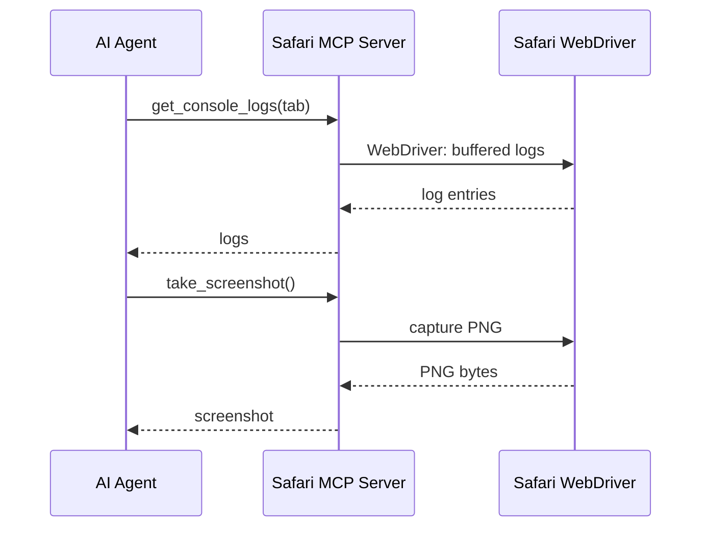

# MCPs — 2026-07-08

## Apple Safari MCP Server (Technology Preview 247) 

**Source:** [9to5Mac](https://9to5mac.com/2026/07/01/safaris-new-mcp-server-lets-coding-agents-inspect-and-debug-websites/) · [MacRumors](https://www.macrumors.com/2026/07/01/apple-releases-safari-technology-preview-247/) · **Type:** release · **Time (UTC):** — (released July 1, not covered in prior digests)

Apple shipped an official MCP server for Safari in Technology Preview 247, making it the first major browser vendor to release an official MCP integration. The server gives any MCP-compatible client (Claude, Cursor, VS Code, ChatGPT, Gemini) direct access to Safari's Web Inspector: buffered console logs, network request summaries (URL, method, status, timing), page screenshots as PNG, and sequential DOM interaction (click, type, scroll, hover). It also exposes Safari compatibility checks, performance analysis, and accessibility evaluation. The server runs entirely locally via Safari's WebDriver binary—no data is sent to Apple—but operates in an isolated automation session with no access to the user's existing cookies, logins, or open tabs.

**Why it matters:** Coding agents can now close the write→browser→prompt→fix loop autonomously inside Safari without manual DevTools switching. Safari was the last holdout among major browsers without an official MCP server.

---

## Automox MCP Server 2.2 

**Source:** [GlobeNewsWire](https://www.globenewswire.com/news-release/2026/07/07/3323274/0/en/Automox-MCP-Server-2-2-Brings-Visual-Review-Agentic-Patch-by-Severity-Policy-Creation-and-Live-Capability-Discovery-to-Endpoint-Operations.html) · **Type:** release · **Time (UTC):** — (July 7)

Automox released MCP Server 2.2 with three additions to its governed endpoint management interface: (1) visual review surfaces that let agents display proposed change sets before execution, requiring human confirmation before changes are applied; (2) Patch by Severity Policy creation, where agents author patching policies in natural language and Automox enforces them across device fleets; and (3) live capability discovery, allowing agents to query available operations at runtime without static tool manifests.

**Why it matters:** Visual pre-execution review and natural-language policy authoring address the two most common objections to agent-driven IT operations in enterprise contexts. These features move the product from "demo-ready" to "approval-workflow-ready" for security teams.

---

## Featured MCP Server for PR professionals 

**Source:** [GlobeNewsWire](https://www.globenewswire.com/news-release/2026/07/07/3323391/0/en/Featured-Launches-an-MCP-Server-Bringing-AI-Agents-to-PR-Agencies.html) · **Type:** launch · **Time (UTC):** — (July 7)

Featured, an AI co-pilot for PR workflows, launched general availability of its MCP server, connecting Claude, Cursor, VS Code, and other MCP-compatible clients directly to Featured accounts. The server exposes client account data, media contact directories, and campaign performance metrics as MCP tools, enabling agents to draft pitches, track outreach, and analyze campaign results from within a coding or chat interface.

**Why it matters:** A narrow vertical MCP server for PR work; another data point that the MCP tooling pattern is spreading from developer tooling into niche professional software categories.
