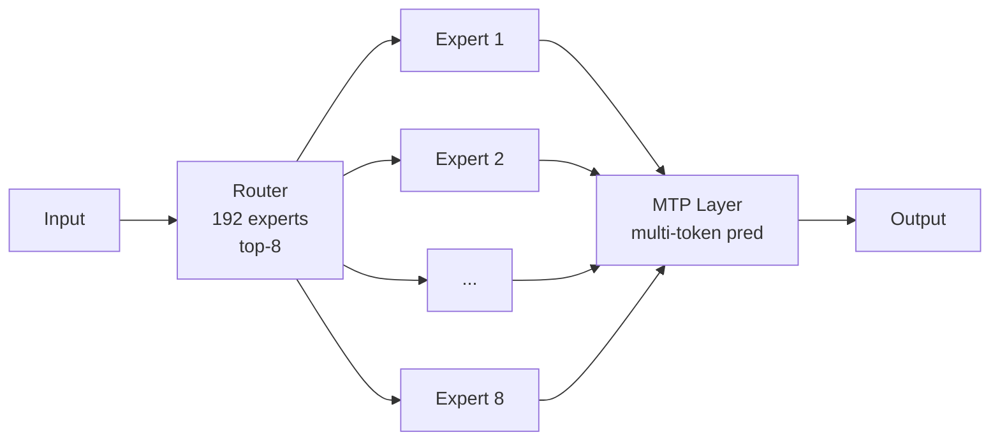

# Models — 2026-07-08

## GPT-5.6 Sol, Terra, and Luna confirmed for July 9 general availability 

**Source:** [Neowin](https://www.neowin.net/news/openai-to-release-gpt-56-sol-terra-and-luna-on-july-9/) · [OpenAI preview page](https://openai.com/index/previewing-gpt-5-6-sol/) · **Type:** release · **Time (UTC):** —

OpenAI confirmed today that all three GPT-5.6 models go generally available on July 9, 2026, following clearance from the U.S. Department of Commerce after a government-gated preview that began June 26. The three-tier family: Sol ($5/$30 per MTok input/output) is the flagship; Terra ($2.50/$15) is the mid-range option targeting coding and professional knowledge work; Luna ($1/$6) is the fast, cost-efficient tier for high-volume workloads. Sol also runs on Cerebras hardware at up to 750 tokens per second. Yesterday's digest noted the Sol-only access window; today's announcement adds Terra and Luna and sets the specific July 9 date for all three.

**Why it matters:** Terra at $2.50/$15 lands squarely against Claude Sonnet 5 ($2/$10 intro through August 31, then $3/$15 standard), giving developers a direct like-for-like pricing comparison. Luna at $1/$6 creates a new competitive tier below anything Anthropic currently lists. GPT-5.6 is OpenAI's first model family cleared through a government pre-release review process.

| Tier | Input ($/MTok) | Output ($/MTok) | Position |
|------|---------------:|----------------:|----------|
| Sol  | $5.00 | $30.00 | Flagship |
| Terra | $2.50 | $15.00 | Mid-range |
| Luna | $1.00 | $6.00 | Fast/cheap |

---

## Gemini 3.5 Pro: ground-up architectural rebuild, July 17 target reported 

**Source:** [BigGo Finance](https://finance.biggo.com/news/6f0c6bb2-795f-4c57-9d09-6db691d7638a) · [TechTimes](https://www.techtimes.com/articles/319877/20260708/gemini-35-pro-targets-july-17-deepseeks-july-24-deadline-hits-developers-now.htm) · **Type:** update · **Time (UTC):** —

Google has scrapped the Gemini 2.5 Pro architecture and begun a new pre-training cycle rather than iterating on the existing base. Multiple reports cite July 17 as the new target, though Google has not officially confirmed this date. Internal concerns driving the rebuild include token efficiency, coding performance below flagship expectations, and multi-step reasoning that fell short in late testing. The rebuilt model is expected to introduce a 2M-token context window, a "Deep Think" reasoning layer for complex problem solving, improved mathematical reasoning, and better SVG scene generation.

**Why it matters:** A ground-up rebuild rather than a fine-tuning patch signals Google is willing to accept further delay to fix structural performance gaps—competitive pressure from GPT-5.6 and Fable 5 is apparently outweighing schedule pressure. Developers relying on Gemini 2.5 Pro in Vertex AI enterprise preview should plan for at least another 9–10 days of uncertainty.

---

## Tencent Hy3: 295B open MoE with 256K context, Apache 2.0 

**Source:** [HuggingFace model page](https://huggingface.co/tencent/Hy3) · [MarkTechPost](https://www.marktechpost.com/2026/07/06/tencent-releases-hy3-open-295b-moe-model/) · [Caixin Global](https://www.caixinglobal.com/2026-07-06/tencent-launches-upgraded-hunyuan-3-ai-model-with-free-agent-feature-102461489.html) · **Type:** release · **Time (UTC):** — (released July 6, not covered in prior digests)

Tencent released Hy3 on July 6 under Apache 2.0: a 295B-parameter mixture-of-experts model with 192 experts and top-8 routing, yielding 21B active parameters per token. The architecture adds a Multi-Token Prediction layer for faster decoding and targets reasoning, agentic coding, and long-context tasks. Context window is 256K tokens. Reported benchmarks: GPQA Diamond 90.4, USAMO 2026 72.0, IMOAnswerBench 90.0. A free API tier is available on OpenRouter (`tencent/hy3:free`) through July 21; after that, paid pricing applies.

**Why it matters:** Apache 2.0 with a free inference tier makes this the most permissively licensed 295B MoE currently available. The 21B active-parameter footprint keeps per-token compute tractable. It is the largest open-weight model directly competing with Fable 5 and GPT-5.6 Sol on reasoning benchmarks.

