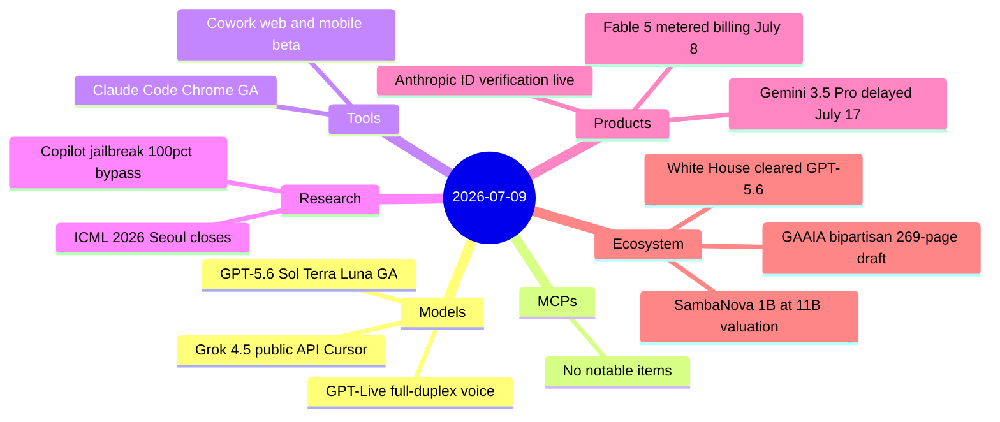
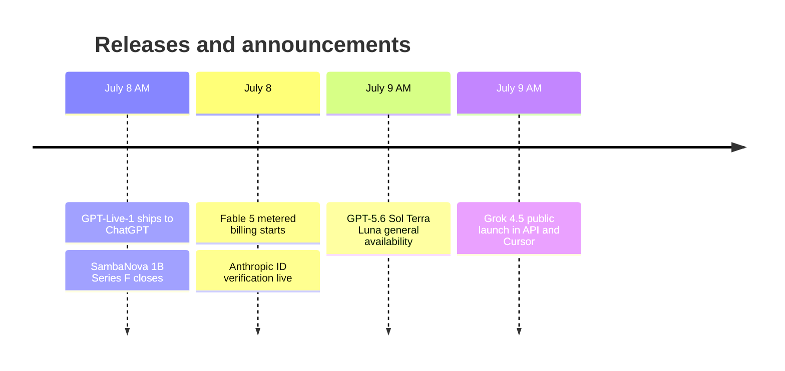

# AI Digest — 2026-07-09

> July 9 was a frontier model log-jam: OpenAI's GPT-5.6 family (Sol, Terra, Luna) reached general availability after explicit White House Department of Commerce clearance, while xAI's Grok 4.5 — a 1.5-trillion-parameter, Opus-class model — also launched publicly in the API and Cursor on the same day. A day earlier, OpenAI shipped GPT-Live-1, the first full-duplex voice model that listens and speaks simultaneously. The week's infrastructure headline is SambaNova closing a $1B Series F at an $11B valuation with JPMorgan Chase as its anchor inference customer. On the Anthropic side, Fable 5 moved to $10/$50 per MTok metered billing, an identity-verification policy requiring government ID and face scans took effect, and Claude Cowork reached web and mobile.

## Day at a glance

## Top stories

1. **GPT-5.6 Sol/Terra/Luna GA + Grok 4.5 launch — same day** — Two Opus-class frontier model families hit the public API on July 9; GPT-5.6 was explicitly cleared by the White House DoC review, and Grok 4.5 exits private beta at a notably lower $2/$6 per MTok price point. [→ details](models.md#gpt-56-sol-terra-luna)
2. **GPT-Live-1: first full-duplex AI voice model** — Consolidates separate ASR/LLM/TTS components into a single end-to-end model that can listen and speak simultaneously; replaces Advanced Voice Mode as ChatGPT's default. [→ details](models.md#gpt-live-1)
3. **SambaNova $1B Series F at $11B valuation** — Inference chip startup more than doubled its 2021 valuation with a General Atlantic-led round; JPMorgan Chase announced as the flagship deployment partner for SN40/SN50 systems. [→ details](ecosystem.md#sambanova-1b-series-f)

## By the numbers

| Category   | Items | Highlight |
|------------|------:|-----------|
| Models     |     3 | GPT-5.6 GA · GPT-Live · Grok 4.5 |
| MCPs       |     0 | No notable items |
| Tools      |     2 | Cowork web/mobile · Claude Code Chrome GA |
| Research   |     2 | Copilot workflow jailbreak · ICML 2026 |
| Products   |     3 | Fable 5 billing · ID verification · Gemini delay |
| Ecosystem  |     3 | SambaNova $1B · WH clearance · GAAIA draft |

## Timeline (UTC)

## Files
- [Models](models.md)
- [MCPs](mcps.md)
- [Tools](tools.md)
- [Research](research.md)
- [Products](products.md)
- [Ecosystem](ecosystem.md)
