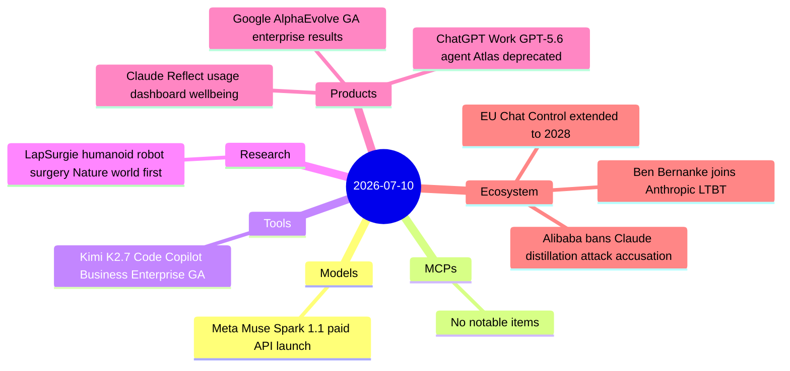
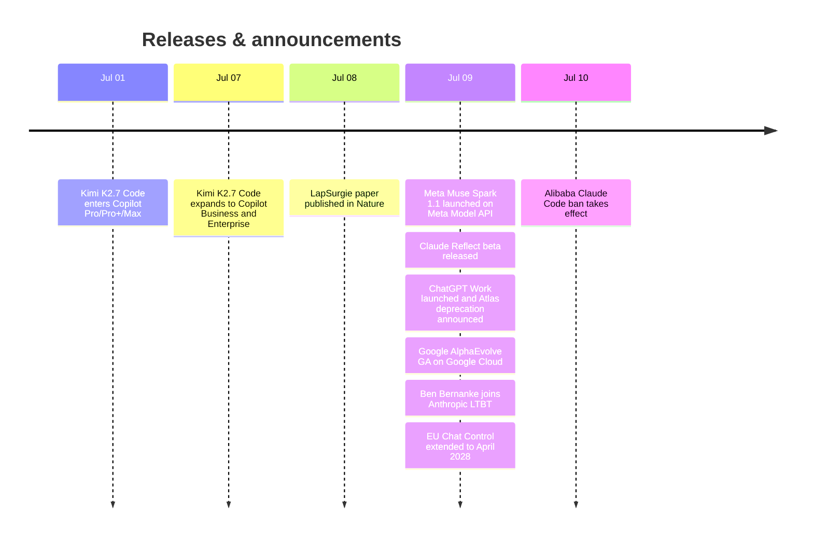

# AI Digest — 2026-07-10

> The day's sharpest story is a mutual escalation between Anthropic and Alibaba: Anthropic publicly accused Alibaba of the largest known model-distillation attack (28.8M exchanges via 25,000 fake accounts, April–June 2026), and Alibaba responded by banning employees from Claude Code as of today, redirecting them to its own Qoder platform. On the model front, Meta entered the paid commercial API market for the first time with Muse Spark 1.1 at $1.25/$4.25 per MTok, a significant undercut of closed-API rivals. OpenAI consolidated its agentic surface with ChatGPT Work (a GPT-5.6-powered workflow agent), merged Codex into the desktop app, and deprecated the nine-month-old Atlas browser. Google made AlphaEvolve generally available with documented double-digit performance gains across ten enterprise early adopters.

## Day at a glance

## Top stories

1. **Alibaba bans Claude Code; Anthropic alleges 28.8M-exchange distillation attack** — Effective today, Alibaba employees must use Qoder instead of Claude Code; Anthropic's June 10 Senate letter alleged 25,000 fake accounts systematically harvested Claude outputs to train Qwen. [→ details](ecosystem.md#alibaba-anthropic-distillation)
2. **Meta enters paid inference market with Muse Spark 1.1** — The Meta Model API opens in public preview with Meta's first paid model at $1.25/$4.25 per MTok; directly undercuts GPT-5.6 Sol ($5/$30) and Fable 5 ($10/$50). [→ details](models.md#meta-muse-spark-1-1)
3. **ChatGPT Work launches; Atlas browser deprecated Aug 9** — OpenAI ships a GPT-5.6-powered workflow agent, unifies Chat/Work/Codex into one desktop app for all plans including Free, and retires its standalone AI browser nine months after launch. [→ details](products.md#chatgpt-work-atlas)

## By the numbers

| Category   | Items | Highlight |
|------------|------:|-----------|
| Models     |     1 | Meta Muse Spark 1.1: $1.25/$4.25 per MTok, 1M context, multimodal agentic |
| MCPs       |     0 | — |
| Tools      |     1 | Kimi K2.7 Code: first open-weight model in GitHub Copilot, now Business/Enterprise |
| Research   |     1 | LapSurgie: teleoperated humanoid robots complete live gallbladder surgery (Nature) |
| Products   |     3 | Claude Reflect · ChatGPT Work + Atlas shutdown · AlphaEvolve GA |
| Ecosystem  |     3 | Alibaba-Anthropic · Ben Bernanke LTBT · EU Chat Control 2028 |

## Timeline (UTC)

## Files
- [Models](models.md)
- [MCPs](mcps.md)
- [Tools](tools.md)
- [Research](research.md)
- [Products](products.md)
- [Ecosystem](ecosystem.md)
