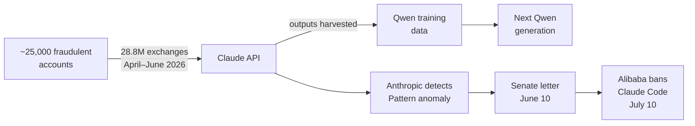

# Ecosystem — 2026-07-10

## Alibaba bans Claude Code as Anthropic accuses it of record distillation attack 

**Source:** [CNBC](https://www.cnbc.com/2026/07/06/alibaba-anthropic-ai-ban-claude-china.html) · [TechCrunch](https://techcrunch.com/2026/07/04/alibaba-reportedly-bans-employees-from-using-claude-code/) · **Type:** dispute/policy · **Time (UTC):** July 10 (effective date)

Alibaba formally required employees to switch from Anthropic's Claude Code to its internal Qoder platform as of July 10, citing alleged backdoor security risks embedded in Claude Code for detecting Chinese users or affiliated labs. In a June 10 letter to US Senators Tim Scott and Elizabeth Warren, Anthropic alleged that entities affiliated with Alibaba and its Qwen team ran "the largest known distillation attack" on its models: approximately 28.8 million exchanges via nearly 25,000 fraudulent accounts between April 22 and June 5, 2026, systematically targeting Claude's strongest capabilities — agentic reasoning, software engineering, and long-horizon multi-step tasks. Anthropic says the extracted outputs were used to train Qwen model generations. Alibaba denies the allegations. The 28.8 million figure has not been independently verified.

**Why it matters:** Model IP extraction at industrial scale is an emerging threat class. For engineers choosing inference providers, this episode illustrates that API terms-of-service prohibiting distillation are enforceable via fraud-based claims even without copyright law clarity, and that behavior flagging for prohibited-country origin is now embedded in commercial model infrastructure.

---

## Ben Bernanke joins Anthropic's Long-Term Benefit Trust 

**Source:** [Anthropic](https://www.anthropic.com/news/ben-bernanke) · **Type:** governance · **Time (UTC):** July 9

Former Federal Reserve Chair Ben Bernanke (Fed Chair 2006–2014, 2022 Nobel laureate in Economics) was appointed to Anthropic's Long-Term Benefit Trust on July 9. The LTBT is Anthropic's independent oversight body: trustees hold no equity, receive no profit share, and are compensated only for time. The Trust has authority to appoint Anthropic board members and advises on decisions involving AI risk and societal impact. Bernanke joins Neil Buddy Shah, Richard Fontaine, and Mariano-Florentino Cuéllar.

Separately, Anthropic launched an "Inviting Hard Questions" initiative on the same day, asking the public to submit their most difficult questions about AI safety, job displacement, creative work, and human agency, and committing to show its work in addressing them.

**Why it matters:** Adding a crisis-era central banker to an AI oversight body signals Anthropic is positioning the LTBT as a systemic-risk governance layer, not just an ethics advisory. The timing alongside the Hard Questions initiative suggests a coordinated transparency push following the ID verification and billing changes that took effect July 8–9.

---

## EU Chat Control extended to April 2028 despite majority MEP opposition 

**Source:** [TechTimes](https://www.techtimes.com/articles/320010/20260709/eu-parliament-passes-chat-control-default-314-meps-couldnt-block-scanning-law.htm) · [Euronews](https://www.euronews.com/my-europe/2026/07/07/eu-to-extend-temporary-message-scanning-regime-to-detect-child-sexual-abuse-online) · **Type:** regulation · **Time (UTC):** July 9

The European Parliament voted on July 9 to extend the EU's interim Chat Control derogation — which permits platforms including Gmail, Snapchat, Facebook Messenger, and Skype to voluntarily scan private messages for child sexual abuse material — through April 3, 2028. 314 MEPs voted against the extension and 276 in favor, but under the ordinary legislative procedure's second-reading rules, rejection required an absolute majority of all 720 MEPs (361), not just a majority of those voting. A procedural maneuver by the European People's Party invoked these rules to pass the extension despite more lawmakers opposing it. An amendment explicitly exempting end-to-end encrypted services from the derogation's scope was also adopted.

**Why it matters:** For developers building EU-facing messaging applications, the extension keeps voluntary CSAM scanning legally permissible — and commercially pressured — for two more years. The E2EE exemption amendment limits direct exposure for end-to-end encrypted apps, but the underlying tension between privacy law and surveillance mandates remains unresolved and will resurface before the 2028 deadline.

---
