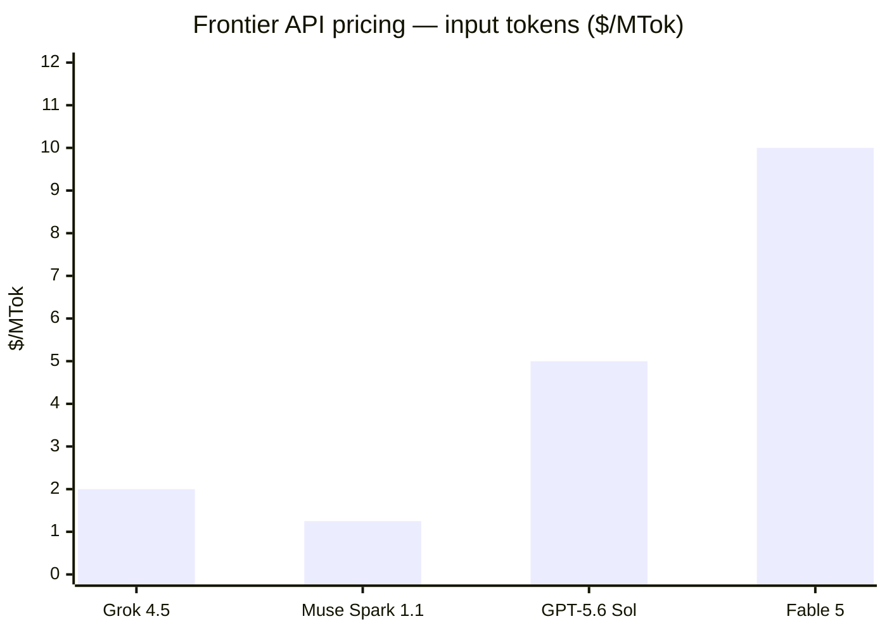

# Models — 2026-07-10

## Meta Muse Spark 1.1 

**Source:** [ai.meta.com](https://ai.meta.com/blog/introducing-muse-spark-meta-model-api/) · **Type:** launch · **Time (UTC):** ~14:00

Meta Superintelligence Labs released Muse Spark 1.1 on July 9 and simultaneously opened the Meta Model API in public preview to US developers. The model is a multimodal reasoning system targeting agentic tasks, with a 1 million-token context window; Meta claims substantial gains over the previous Muse Spark in tool use, computer use, coding, and multimodal understanding. Developers receive $20 in free credits before switching to pay-as-you-go.

| Spec | Value |
|------|-------|
| Input price | $1.25 / MTok |
| Output price | $4.25 / MTok |
| Context window | 1M tokens |
| Strengths | Tool use, computer use, coding, multimodal reasoning |

**Why it matters:** This marks Meta's first entry into the paid commercial API model market, directly competing with Anthropic and OpenAI on pricing (well below Fable 5 at $10/$50 and GPT-5.6 Sol at $5/$30). The Meta Model API launch means enterprises now have a fourth mainstream paid inference provider for frontier-class agentic models.

---
