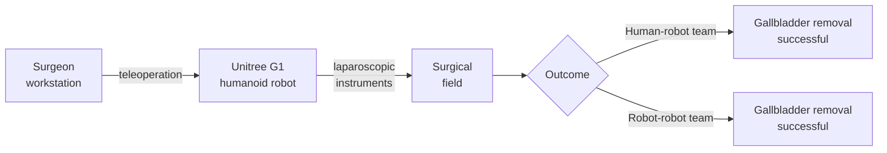

# Research — 2026-07-10

## LapSurgie: Teleoperated humanoid robots complete world-first live surgery 

**Source:** [MedicalXpress / Nature](https://medicalxpress.com/news/2026-07-surgeons-teleoperated-humanoid-robots-surgery.html) · **Type:** paper · **Time (UTC):** July 8 (Nature issue date)

Researchers at UC San Diego published results in Nature showing two Unitree G1 humanoid robots completing minimally invasive gallbladder removals on live pigs — the first time teleoperated humanoid robots have performed live surgery in a preclinical trial. The experiment ran two configurations: a human-robot team (one surgeon teleoperating a G1, the other a human assistant) and a robot-robot team (two G1 units controlled by two surgeons). Both configurations successfully completed the laparoscopic procedure.

**Why it matters:** Standard surgical robots like the da Vinci require fixed, specialized installation costing $1–2M+ and are impractical for smaller hospitals. Humanoid robots running teleoperation firmware are commercially available off-the-shelf and can be deployed where dedicated surgical systems cannot. This paper is a proof-of-concept that general-purpose humanoid embodiment can substitute for surgical-specific hardware, though regulatory and reliability hurdles for human trials remain.

---
