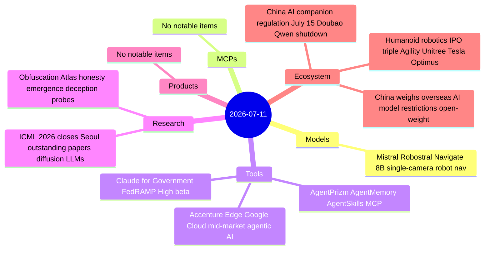
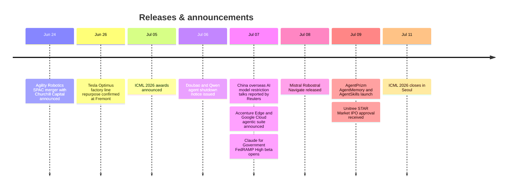

# AI Digest — 2026-07-11

> The week's structural story is humanoid robotics converging on public capital markets: Agility Robotics ($2.5B SPAC, first US-listed pure-play humanoid), Unitree (STAR Market IPO approved at ~$14.7B, the volume leader with 5,500 units shipped), and Tesla repurposing its Model S/X factory line for Optimus Gen3 production — all in the same week. Alongside the hardware story, Mistral launched Robostral Navigate, an 8B single-camera robot navigation model that outperforms multi-sensor systems. China's regulatory picture hardened on two fronts: Doubao and Qwen are shutting down AI companion/agent features July 15 under a new anthropomorphic AI regulation, while Beijing is separately weighing overseas access restrictions on its own open-weight models — a sharp reversal of the open-distribution strategy that made Qwen and GLM-5.2 globally popular. ICML 2026 closed in Seoul with outstanding paper awards calling out a critical flaw in diffusion LLM architectures (arbitrary-order generation hurts reasoning) and a position paper arguing alignment research inadvertently builds a censor's toolkit.

## Day at a glance

## Top stories

1. **Humanoid robotics triple IPO convergence** — Agility Robotics (SPAC, $2.5B), Unitree (STAR Market, ~$14.7B), and Tesla (Optimus factory line repurposed) all moved toward public markets in one week; the first forced disclosure of real humanoid unit economics approaches. [→ details](ecosystem.md#humanoid-robotics-ipo)
2. **China's AI regulatory double-move** — Doubao and Qwen shut down companion/agent features July 15 under a new anthropomorphic AI regulation, while Beijing separately weighs restricting overseas access to its open-weight models — which would remove the primary affordable alternative to US APIs globally. [→ details](ecosystem.md#china-companion-regulation)
3. **Mistral Robostral Navigate — single-camera robot nav beats multi-sensor baselines** — 8B model trained in simulation only reaches 76.6% on R2R-CE unseen, +4.5pp over the best depth/multi-camera system; first production-grade robotics model from a European AI lab. [→ details](models.md#robostral-navigate)

## By the numbers

| Category   | Items | Highlight |
|------------|------:|-----------|
| Models     |     1 | Robostral Navigate: 76.6% R2R-CE unseen, no LiDAR or depth sensors |
| MCPs       |     0 | — |
| Tools      |     3 | AgentPrizm: persistent memory + skill marketplace via MCP |
| Research   |     2 | ICML 2026: diffusion LLM flexibility trap, alignment-as-censorship position paper |
| Products   |     0 | — |
| Ecosystem  |     3 | Humanoid robotics IPO · China companion law · China overseas restrictions |

## Timeline (UTC)

## Files
- [Models](models.md)
- [MCPs](mcps.md)
- [Tools](tools.md)
- [Research](research.md)
- [Products](products.md)
- [Ecosystem](ecosystem.md)
