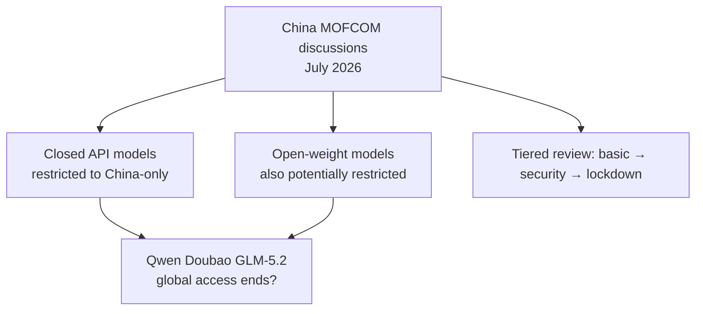

# Ecosystem — 2026-07-11

## China's AI Companion Regulation Takes Effect July 15 — Doubao and Qwen Shut Down Agent Features 

**Source:** [TechNode](https://technode.com/2026/07/06/bytedances-doubao-and-alibabas-qwen-to-shut-down-ai-agent-features-on-july-15/) · [Bloomberg](https://www.bloomberg.com/news/articles/2026-07-06/bytedance-alibaba-pull-ai-companions-as-beijing-tightens-rules) · [Global Times](https://www.globaltimes.cn/page/202607/1365159.shtml) · **Type:** regulation · **Time (UTC):** effective July 15

China's Cyberspace Administration and four co-signing agencies published final "Interim Measures for the Administration of Anthropomorphic AI Interaction Services" in April 2026; they take effect July 15. The regulation targets services that simulate personality traits, thinking patterns, and communication styles of real people for continuous emotional interaction. Standard productivity chatbots, customer service bots, and Q&A assistants are explicitly excluded from scope.

ByteDance's Doubao (China's most-used AI chatbot) and Alibaba's Qwen announced that all user-created AI agent and companion features will be shut down on July 15. Alibaba's Qwen shut its humanlike and user-created agents on July 10; its wider agent services follow July 15. ByteDance is redirecting Doubao users to Maoxiang, a separate ByteDance platform. User data — agent configurations and chat histories — remains accessible until October 15, 2026, after which it becomes unrecoverable.

**Key requirements for services that continue under the regulation:**
- No companion or virtual family-member services for minors; guardian consent required for users under 14
- Dedicated "minor modes" with usage-time limits and parental controls
- No content encouraging self-harm or emotional dependence that damages real-world relationships
- Mandatory security assessments and provincial regulatory filings for services exceeding 1M registered users or 100K monthly actives

**Why it matters:** China's consumer AI ecosystem is second in size only to the US. The simultaneous compliance-driven shutdown of user-created agents on the two largest Chinese LLM platforms removes an entire product category overnight. For engineers benchmarking consumer agent frameworks, Doubao's adoption data — previously one of the few real-world signals on scale — goes dark. The regulation also sets the model for how Beijing intends to govern emotionally interactive AI: not prohibition, but heavy licensing, mandatory minor protections, and audit receipts.

---

## China Weighs Restricting Overseas Access to Its Most Advanced AI Models 

**Source:** [The Next Web](https://thenextweb.com/news/china-curbing-overseas-access-top-ai-models) · [Quartz](https://qz.com/beijing-china-ai-model-export-restrictions-070726) · [Time](https://time.com/article/2026/07/07/china-ai-models-alibaba-bytedance/) · **Type:** policy · **Time (UTC):** July 7

China's Ministry of Commerce held meetings with Alibaba, ByteDance, and startup Z.ai to discuss restricting foreign access to their most capable AI models, Reuters reported July 7. Crucially, the proposed scope extends beyond closed-API models to open-weight models — the freely downloadable systems through which Chinese AI (Qwen, Doubao, GLM-5.2) gained wide adoption abroad. Officials have decided nothing; sources said any controls might apply only to future models and no timeline exists.

Additional ideas discussed: classifying the leak or theft of proprietary AI model weights as a national security crime, and limiting which foreign investors can fund Chinese AI firms. One panel of Chinese legal scholars proposed a tiered scheme — light filing for basic tools, security reviews for stronger models, and domestic-only lockdown for the most sensitive.

**Why it matters:** Chinese open-weight models have been priced as a substitute for US commercial APIs — Qwen and GLM models undercut US frontier pricing by 60–80%. Any export control scheme that reached open-weight models would remove the freely downloadable alternative entirely, pushing international developers back toward US or European paid APIs. The proposal also mirrors the US export control trajectory: after the June 2026 Fable 5 incident, both superpowers are now actively considering using AI model access as a geopolitical instrument. The fact that even open-weight models are on the table represents a fundamental shift in China's prior strategy of winning global goodwill through open distribution.

---

## Humanoid Robotics Triple IPO Convergence — Agility, Unitree, Tesla Optimus 

**Source:** [TechCrunch](https://techcrunch.com/2026/07/05/this-humanoid-robotics-company-is-going-public-but-its-ceo-isnt-promising-a-robot-in-your-home-anytime-soon/) · [Forbes](https://www.forbes.com/sites/johnkoetsier/2026/06/24/first-humanoid-robot-maker-goes-public-in-us-25-billion-deal-new-robot-300-million-in-pre-orders/) · [BigGo Finance](https://finance.biggo.com/news/3bf8df38-4754-4491-bed4-5e018280441f) · **Type:** funding/IPO · **Time (UTC):** June–July

Three humanoid robotics companies moved toward public capital markets in a single week:

**Agility Robotics (US, Nasdaq SPAC):** Agility agreed to merge with Churchill Capital Corp XI at a $2.5B valuation, expected to raise over $620M — the largest capital raise in humanoid robotics history. If approved by shareholders, Agility would become the first US-listed pure-play humanoid company. CEO Peggy Johnson has $300M in multi-year pre-orders (roughly 1,000 robots on robots-as-a-service contracts) from Amazon, GXO Logistics, and Toyota. Johnson said it will take "10-plus years" before humanoids enter homes; warehouse predictability is the current enabling constraint.

**Unitree Technology (China, STAR Market):** Unitree received Shanghai STAR Market IPO approval, with valuation expectations above 100 billion yuan (~$14.7B). Unitree shipped more than 5,500 humanoid units in 2025, making it the global volume leader. Unlike Agility's service-contract model, Unitree sells hardware directly.

**Tesla Optimus (US, internal factory line):** Tesla completed repurposing of its former Model S/X production line at Fremont into a dedicated Optimus Gen3 assembly facility, with a designed annual capacity of 1 million units. Musk cautioned that initial production will be "extremely slow" due to a near-absent supply chain for ~10,000 new components, with true mass production dependent on a dedicated Texas facility planned for 2027.

| Company | Path | Valuation | Units/Pre-orders | Timeline |
|---------|------|----------:|-----------------|----------|
| Agility Robotics | SPAC → Nasdaq | $2.5B | ~1,000 (pre-orders, $300M) | Approval ~late 2026 |
| Unitree Technology | STAR Market IPO | ~$14.7B | 5,500+ shipped in 2025 | Pending |
| Tesla Optimus | Internal production | — | 1M unit capacity (designed) | Mass production 2027+ |

**Why it matters:** Humanoid robots moving from venture-backed private companies to public markets simultaneously is a liquidity milestone: it forces financial disclosure of actual unit economics, customer concentration, and margin structures that have been opaque in private rounds. For AI engineers, the convergence of ML-based navigation (like Robostral Navigate) and vision-language models with robot hardware that is approaching mass production volumes creates new addressable deployment targets within 12–24 months.

---
