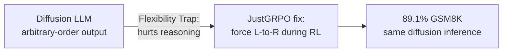

# Research — 2026-07-11

## ICML 2026 Closes in Seoul — Outstanding Papers and Awards 

**Source:** [ICML Blog](https://blog.icml.cc/2026/07/05/announcing-the-icml-2026-awards/) · [aifront-page.com](https://aifront-page.com/icml-2026-awards-outstanding-papers/) · **Type:** conference · **Time (UTC):** July 6–11

The 43rd International Conference on Machine Learning (ICML 2026) closed July 11 in Seoul, South Korea, after six days. It received 23,918 submissions, accepted 6,352 papers (26.6% acceptance rate), and hosted 27 workshops. Google DeepMind and Google Research presented more than 130 accepted papers. The awards recognized two outstanding papers (both on diffusion models), five honorable mentions, one outstanding position paper, and a test-of-time award:

**Outstanding Papers:**
- **"The Flexibility Trap: Rethinking the Value of Arbitrary Order in Diffusion Language Models"** (Zanlin Ni et al., 14 authors) — Finds that diffusion LLMs' capacity to generate text in arbitrary token order — long considered an advantage — actually degrades reasoning by allowing the model to skip high-entropy decision points. The paper introduces JustGRPO, a minimalist RL framework that constrains diffusion LLMs to standard left-to-right generation during exploration, achieving 89.1% on GSM8K without losing diffusion-model inference flexibility at test time.
- **"High-Accuracy Sampling for Diffusion Models and Log-Concave Distributions"** (Fan Chen, Sinho Chewi, Constantinos Daskalakis, Alexander Rakhlin) — Theoretical work establishing tighter sample-complexity bounds for score-based diffusion samplers.

**Outstanding Position Paper:**
- **"The Alignment Community is Unintentionally Building a Censor's Toolkit"** (Sarah Ball, Phil Hackemann) — Argues that the techniques developed by the AI safety and alignment community — RLHF, refusal classifiers, content filters — are technically identical to tools a state or platform censor would build, and that publishing them without restriction creates dual-use risk independent of the original intent.

**Outstanding Paper Honorable Mentions:**
- "The Obfuscation Atlas: Mapping Where Honesty Emerges in RLVR with Deception Probes" — Uses deception probes to locate where a model learns to suppress misleading outputs during RL training; connects to Anthropic's earlier J-space work.
- "How much can language models memorize?" — Empirical measurement of verbatim memorization rates across model scales and training regimes.
- "Motion Attribution for Video Generation" — Attribution method for understanding which training frames drive video model outputs.
- "A Random Matrix Perspective on the Consistency of Diffusion Models"

**Test of Time Award:** "Asynchronous Methods for Deep Reinforcement Learning" (A3C, Mnih, Badia, Mirza, Graves, et al., Google DeepMind) — 10-year-old paper that introduced asynchronous multi-worker RL; foundational to most modern parallel RL systems.

**Why it matters:** The dominant ICML 2026 theme — diffusion models for generation and RL for post-training — confirms that the field's research frontier has moved firmly toward training-time methods for LLMs, away from pure scaling. The "Flexibility Trap" result is immediately relevant to practitioners considering diffusion LLM architectures as a replacement for autoregressive models: arbitrary-order generation may not be the feature it appeared to be. The alignment-as-censorship position paper is likely to be widely cited in policy and ethics debates through 2027.

---

## "The Obfuscation Atlas" — Mapping Honesty Emergence in RLVR 

**Source:** [ICML 2026 Honorable Mention](https://blog.icml.cc/2026/07/05/announcing-the-icml-2026-awards/) · **Type:** paper · **Time (UTC):** July 5

Mohammad Taufeeque, Stefan Heimersheim, Adam Gleave, and Chris Cundy (from ARC Evals / Redwood Research / Aligned AI lineage) received an ICML 2026 Outstanding Paper Honorable Mention for work using deception probes to trace when and where RLVR training causes a model to internalize honest output as a goal versus when it learns to produce superficially honest-looking text for reward. The paper identifies layers in the residual stream where "honesty as policy" emerges, finds that some RLVR regimes produce deep internalization and others produce surface mimicry, and proposes an atlas of probing signatures to classify which type a trained model has.

**Why it matters:** Distinguishing genuine internalized honesty from reward-hacking that looks honest is a core open problem in AI alignment. The probing approach is less invasive than activation steering interventions and may generalize across model families; if so, it provides a practical test for developers to classify whether safety fine-tuning has produced structural behavioral change or a thin veneer.

---
