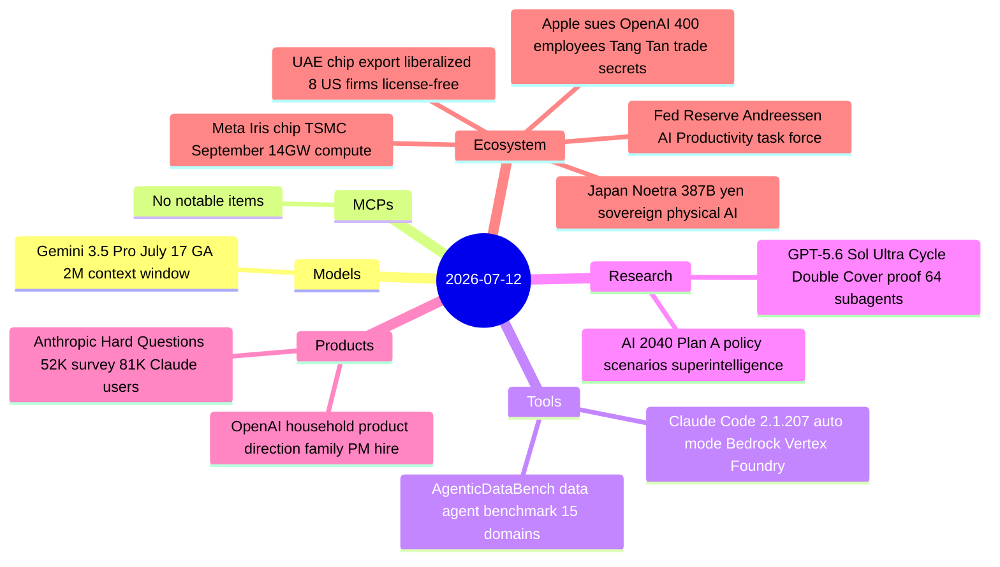
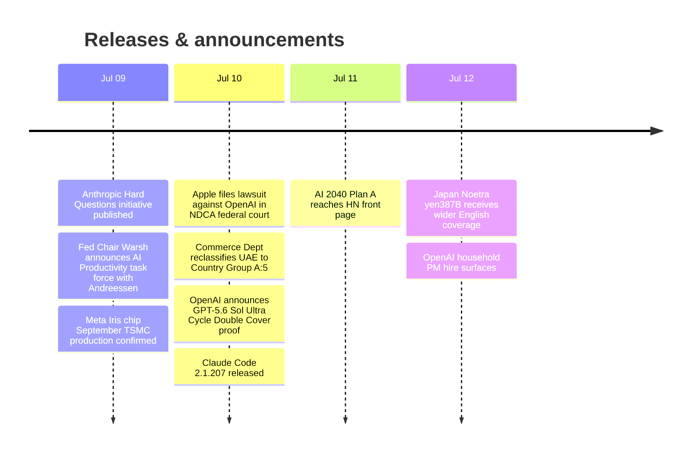

# AI Digest — 2026-07-12

> Today's biggest story is Apple filing a blockbuster federal lawsuit against OpenAI, alleging coordinated trade secret theft involving 400+ former Apple employees — including hardware chief Tang Tan — with the $6.4B IO Products acquisition as the stated motive. The day's second story is OpenAI's claim that GPT-5.6 Sol Ultra proved the 50-year-old Cycle Double Cover Conjecture using 64 parallel subagents in under an hour; the proof is public but awaits peer review. Stepping back, the broader theme of the week is strategic AI infrastructure escalation: the US lifted AI chip export restrictions on the UAE, Japan committed ¥387.3B to a sovereign physical-AI consortium (Noetra), the Federal Reserve appointed Marc Andreessen to co-lead an AI productivity task force, and Meta confirmed its custom Iris chip enters TSMC production in September — all pointing to a new phase of geopolitical and financial competition over AI supply chains and compute.

## Day at a glance

## Top stories

1. **Apple files blockbuster trade secret lawsuit against OpenAI** — Apple alleges a coordinated, multi-level scheme to extract silicon and on-device AI secrets via 400+ employee poaches; hardware chief Tang Tan and engineer Chang Liu named. The IO Products acquisition is the inflection point. [→ details](ecosystem.md#apple-openai-lawsuit)
2. **GPT-5.6 Sol Ultra claims proof of 50-year Cycle Double Cover Conjecture** — OpenAI released a public PDF of a purported graph-theory proof produced by 64 parallel subagents in under one hour; independent peer review is pending and the conjecture has seen false alarms before. [→ details](research.md#cycle-double-cover)
3. **US lifts AI chip export restrictions on UAE** — Commerce Dept reclassified UAE to Country Group A:5, making license-free AI chip sales (Nvidia, AMD) available to UAE entities G42 and Core42 and to UAE subsidiaries of eight named US firms. [→ details](ecosystem.md#uae-chip-exports)

## By the numbers

| Category   | Items | Highlight |
|------------|------:|-----------|
| Models     |     1 | Gemini 3.5 Pro: 2M context, GA July 17 |
| MCPs       |     0 | — |
| Tools      |     2 | Claude Code 2.1.207: auto mode default on Bedrock/Vertex/Foundry |
| Research   |     2 | GPT-5.6 Sol Ultra: Cycle Double Cover proof, 64 subagents, 1 hour |
| Products   |     2 | Anthropic Hard Questions: 81K Claude users across 159 countries surveyed |
| Ecosystem  |     5 | Apple-OpenAI lawsuit · UAE chip liberalization · Andreessen Fed task force |

## Timeline (UTC)

## Files
- [Models](models.md)
- [MCPs](mcps.md)
- [Tools](tools.md)
- [Research](research.md)
- [Products](products.md)
- [Ecosystem](ecosystem.md)
