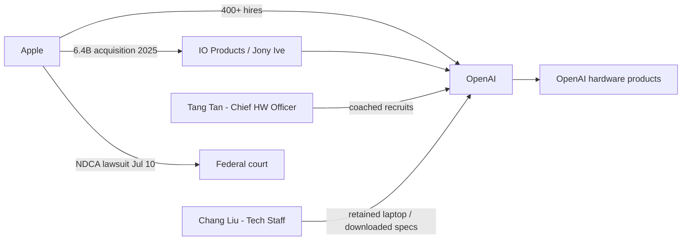

# Ecosystem — 2026-07-12

## Apple files federal lawsuit against OpenAI over trade secret theft 

**Source:** [TechCrunch](https://techcrunch.com/2026/07/10/apple-sues-openai-over-alleged-trade-secret-theft/) · [Axios](https://www.axios.com/2026/07/10/apple-sues-openai-trade-secret-theft) · [Bloomberg](https://www.bloomberg.com/news/articles/2026-07-10/apple-sues-openai-for-trade-secret-theft-in-blockbuster-case) · **Type:** Litigation · **Time (UTC):** July 10

Apple filed suit in the Northern District of California against OpenAI, alleging coordinated theft of confidential hardware designs, manufacturing processes, and supply chain strategies. The complaint alleges misconduct "at every level" of OpenAI's organization. Two named individual defendants: Tang Tan (OpenAI's Chief Hardware Officer and former Apple VP of product design, 24 years at Apple), accused of directing recruiting candidates to share Apple secrets and coaching departing employees on evading Apple's security procedures; and Chang Liu (OpenAI Technical Staff, former senior systems electrical engineer at Apple), accused of retaining an Apple-issued laptop after leaving and using it to download confidential hardware specifications and engineering presentations.

Apple counts 400+ former employees now at OpenAI and frames the pattern as systematic, coordinated extraction rather than incidental knowledge transfer. The trigger is OpenAI's $6.4B acquisition of Jony Ive's IO Products startup in 2025, which put OpenAI directly in competition with Apple in the consumer hardware market — a reversal from the 2024 ChatGPT-on-iPhone partnership.

**Why it matters:** This is the highest-profile IP lawsuit in AI to date. It mirrors the Waymo vs. Uber (2018) playbook — former employees as conduits for systematic secret extraction — but involves much larger industry stakes. If Apple wins or negotiates a significant settlement, it establishes precedent for trade-secret liability when AI labs aggressively recruit from incumbents. For engineers currently at major tech companies considering moves to AI startups, it is a concrete signal about what conduct during transitions can trigger litigation.

---

## US lifts AI chip export restrictions on UAE 

**Source:** [Bloomberg](https://www.bloomberg.com/news/articles/2026-07-10/us-eases-export-curbs-on-uae-opening-door-for-ai-chip-sales) · [9to5Mac](https://9to5mac.com/2026/07/10/us-eases-restrictions-on-apples-access-to-ai-chips-and-data-center-equipment-in-the-uae/) · **Type:** Policy · **Time (UTC):** July 10

The Commerce Department's Bureau of Industry and Security reclassified the UAE to Country Group A:5 effective July 10, eliminating export-license requirements for advanced AI computing hardware, commercial satellites, and specified military items. Eight US companies — Apple, Amazon, Google, Meta, Microsoft, OpenAI, Oracle, and xAI — can now ship advanced AI chips and servers to their UAE-based subsidiaries license-free. UAE entities G42 and Core42 are also approved recipients. The rule cites UAE steps to safeguard American technology and "support for the US in the war against Iran" as justification.

**Why it matters:** This formalizes the Gulf compute corridor that has been in development since the May 2025 US-UAE AI cooperation framework. G42 and Core42 are among the largest AI infrastructure operators in the Middle East, and license-free access dramatically lowers friction for large-scale GPU cluster buildouts. For Nvidia and AMD, this opens a significant untapped market. It also signals that the export control regime is becoming more granular — rewarding aligned partners with liberalized access rather than applying uniform restrictions across the region.

---

## Federal Reserve names Andreessen to co-lead AI Productivity task force 

**Source:** [Axios](https://www.axios.com/2026/07/09/fed-warsh-task-force-andreessen) · [Washington Post](https://www.washingtonpost.com/business/2026/07/09/federal-reserve-enlists-marc-andreessen-advise-ai-under-warsh/) · **Type:** Policy · **Time (UTC):** July 9

Federal Reserve Chair Kevin Warsh announced five external task forces as part of a sweeping monetary policy review. Marc Andreessen (Andreessen Horowitz) was named co-leader of the Productivity and Jobs panel alongside Stanford economist Charles I. Jones and Microsoft EVP Asha Sharma. The panel's mandate is to evaluate how AI and other general-purpose technologies affect labor markets and productivity growth, with concrete recommendations due by end of 2026.

**Why it matters:** The Fed's modeling of potential GDP growth directly informs interest rate decisions. If the Andreessen panel concludes AI-driven productivity gains are substantial and durable, it could justify lower long-run rates — a macro tailwind for the entire AI investment ecosystem. This is the first time a major central bank has embedded AI practitioners (rather than economists alone) in the formal process of evaluating AI's macroeconomic effects.

---

## Meta confirms Iris AI chip enters TSMC production in September 

**Source:** [CNBC](https://www.cnbc.com/2026/07/09/meta-to-put-ai-chip-into-production-in-september-report.html) · [Reuters / FullStackEvolved](https://www.fullstackevolved.com/blog/meta-iris-ai-chip-september-2026-07-10/) · **Type:** Infrastructure · **Time (UTC):** July 9

Meta confirmed via a Reuters report that its Iris AI inference chip enters mass production at TSMC in September 2026. Broadcom is co-designing the chip; testing wrapped up in six weeks with no major issues. The production timeline supports Meta's goal of doubling compute capacity to 14 gigawatts by 2027. Meta has locked supply agreements with Samsung (memory), Sandisk (flash), and Sumitomo Electric (fiber-optic interconnects). Iris is one of four in-house chips under Meta's Training and Inference Accelerators program; the company targets a new chip roughly every six months through 2027.

**Why it matters:** Iris marks the transition from Meta being a pure Nvidia customer to having a credible custom silicon strategy for inference workloads. At 14GW compute by 2027, Meta would have infrastructure capable of running frontier inference at a scale that allows it to serve its 3.4B daily active users with on-device AI features without capacity constraints. The six-month chip cadence — faster than the industry's typical annual pace — is a signal that Meta is treating silicon as a competitive differentiator, not just a procurement exercise.

---

## Japan's Noetra consortium locks in ¥387.3B for sovereign physical AI 

**Source:** [Japan Times](https://www.japantimes.co.jp/news/2026/07/01/japan/japan-ai-plans/) · [Finimize](https://finimize.com/content/japan-picks-softbank-backed-noetra-to-build-a-national-ai-model) · [Asia Times](https://asiatimes.com/2026/07/japan-rallies-tech-giant-alliance-to-build-sovereign-ai/) · **Type:** Funding · **Time (UTC):** July 1 (broader English coverage this week)

Japan's Ministry of Economy, Trade and Industry (METI) awarded a public tender to Noetra — a consortium anchored by SoftBank, Sony, NEC, and Honda with ~44 participating companies — and the national research institute AIST to run a "physical AI" program from FY2026 to FY2030. The first-year tranche is ¥387.3B (~$2.4B); the five-year ceiling is ¥1 trillion (~$6.2B), though continued funding depends on annual stage-gate reviews. Deliverables include a first multimodal foundation model (language + images + video + sensor data) in FY2026 with annually updated versions thereafter, targeting 30% of the global physical AI market by 2040 and deployment of 10 million AI-equipped robots across 18 sectors including food manufacturing and medical by the same year.

**Why it matters:** Noetra is the most credible attempt yet by a major industrial economy to build a domestic physical-AI stack — hardware-grounded models trained on manufacturer data — rather than adapting general-purpose LLMs to robotics. The ¥387.3B first-year commitment is real and contracted (not a political pledge). Combined with the EU's €5B AI infrastructure package and the Gulf compute corridor, it adds a third major non-US vector to the sovereign AI infrastructure race.

---
