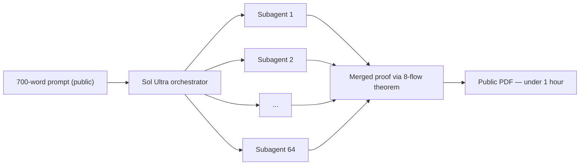

# Research — 2026-07-12

## GPT-5.6 Sol Ultra: claimed proof of 50-year Cycle Double Cover Conjecture 

**Source:** [OpenAI / MLQ News](https://mlq.ai/news/openai-claims-gpt-56-sol-ultra-solved-50-year-old-math-conjecture-in-under-an-hour/) · [The Decoder](https://the-decoder.com/openais-gpt-5-6-sol-ultra-reportedly-solves-a-50-year-old-math-problem-in-under-an-hour/) · **Type:** Research claim · **Time (UTC):** July 10

OpenAI researcher Ethan Knight published a public PDF of a purported proof of the Cycle Double Cover (CDC) Conjecture, attributed to GPT-5.6 Sol Ultra running 64 parallel subagents for under one hour. The CDC Conjecture — posed independently by Szekeres (1973) and Seymour (1979) — asks whether every bridgeless graph has a set of cycles covering each edge exactly twice. The released proof uses the 8-flow theorem and elementary linear algebra. OpenAI also published the 700-word prompt used to direct the multi-agent run.

The proof has not undergone independent peer review. The CDC Conjecture has a documented history of false proofs, including several posted to arXiv that were later retracted. The mathematical community will need several weeks to weeks to validate the argument.

**Why it matters:** If the proof holds, it would mark the first time an AI system has resolved a significant open problem in pure mathematics without substantial human co-authorship — a qualitative shift in what "automated theorem proving" means. Even if gaps are found, the multi-agent orchestration approach (64 subagents, public prompt disclosure) is a methodological contribution worth tracking.

---

## AI 2040: Plan A — scenario document for a managed AI transition 

**Source:** [AI Futures Project / ai-2040.com](https://ai-2040.com/) · **Type:** Policy paper · **Time (UTC):** July 11 (HN front page, 385 pts / 501 comments)

Six researchers from the AI Futures Project (Thomas Larsen, Romeo Dean, Brendan Halstead, Eli Lifland, Ryan Greenblatt, Daniel Kokotajlo) published "AI 2040: Plan A," a detailed scenario document proposing an international agreement to delay development of superintelligent AI systems until 2040. The core argument: current frontier labs lack adequate safety plans, and unchecked progress leads to either extinction or extreme power concentration in a small group of individuals. Plan A calls for mandated transparency and public reporting, strengthened chip export enforcement, compute budget caps on frontier training runs, and distributed cross-national development ("mutually assured compute destruction"). The document contrasts Plan A against four alternative government response scenarios (B–D and S) and frames itself as a stress-test vehicle rather than a prediction.

**Why it matters:** This is a technically detailed policy proposal from researchers with direct industry experience, not a general think-tank brief. The significant HN engagement (385 pts, 501 comments) reflects that practitioners are actively debating whether coordinated international slowdown is feasible or desirable — a discussion with direct implications for export controls, compute taxation, and multinational AI treaties.

---
