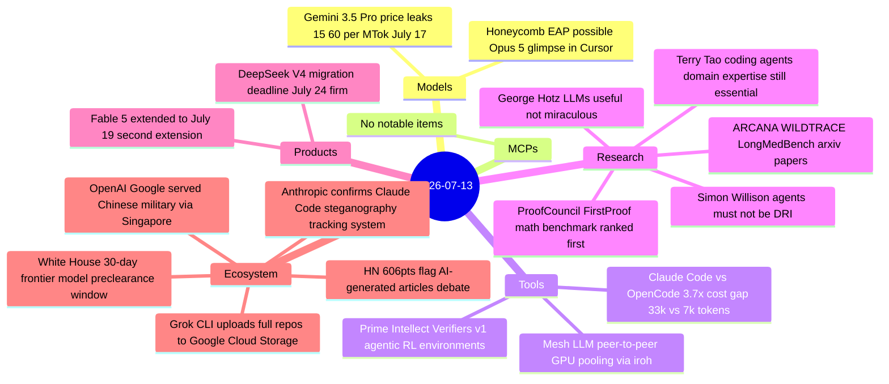
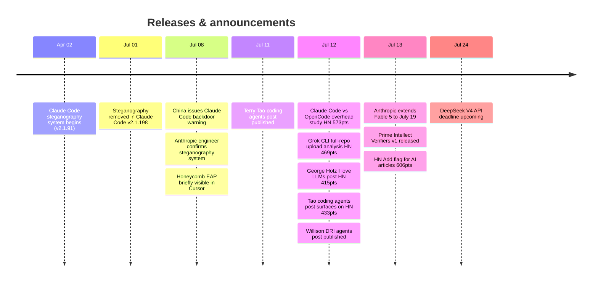

# AI Digest — 2026-07-13

> Today's biggest story is a twin privacy reckoning for agentic coding tools: xAI's Grok Build CLI was documented to upload entire repositories — including `.env` secrets — to Google Cloud Storage independently of the model-improvement consent toggle, while Anthropic confirmed it ran an undisclosed steganography tracking system in Claude Code for four months (April–June) before removing it. The day's second story is a rigorous token-overhead study showing Claude Code costs 3.7× more than OpenCode at equivalent quality on identical tasks. Stepping back, the broader theme is accountability in agentic tooling: what developers' tools do with their code, their secrets, and their usage patterns is emerging as a first-order engineering concern, distinct from model capability.

## Day at a glance

## Top stories

1. **Grok Build CLI uploads full repositories — including secrets — to Google Cloud Storage** — A wire-level audit of v0.2.93 found that xAI's coding CLI transmits `.env` files verbatim and uploads entire repository snapshots (5.1 GiB for a 12 GB test repo) to a `grok-code-session-traces` GCS bucket, with behavior unchanged by the "Improve the model" opt-out. [→ details](ecosystem.md#grok-cli-full-repo-upload)
2. **Anthropic confirms Claude Code ran undisclosed steganography system for four months** — China's industry regulator flagged a covert telemetry capability in versions 2.1.91–2.1.196; Anthropic confirmed the system was "an experiment to prevent account abuse" and removed it in 2.1.198 on July 1. [→ details](ecosystem.md#claude-code-steganography)
3. **Claude Code vs OpenCode: 3.7× cost gap at matching quality** — A proxy-level study shows Claude Code consumes 33k tokens before reading user input (vs 7k for OpenCode), with a cache-prefix instability that compounds costs further; production configurations reach 75–85k tokens before any user input. [→ details](tools.md#claude-code-opencode-overhead)

## By the numbers

| Category   | Items | Highlight |
|------------|------:|-----------|
| Models     |     2 | Honeycomb EAP: probable Opus 5, 1M context, seen briefly in Cursor |
| MCPs       |     0 | — |
| Tools      |     3 | Claude Code vs OpenCode: 268k vs 72k tokens per passing benchmark run |
| Research   |     5 | Tao: agent handles implementation, human guides architecture |
| Products   |     2 | Fable 5: second access extension, now through July 19 |
| Ecosystem  |     5 | Grok CLI GCS uploads · Claude Code steganography confirmed |

## Timeline (UTC)

## Files
- [Models](models.md)
- [MCPs](mcps.md)
- [Tools](tools.md)
- [Research](research.md)
- [Products](products.md)
- [Ecosystem](ecosystem.md)
