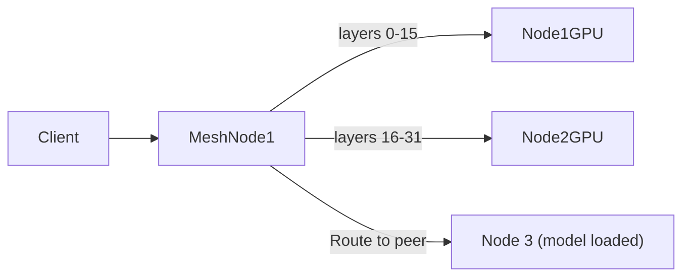

# Tools — 2026-07-13

## Claude Code vs OpenCode: 33k vs 7k token overhead <a id="claude-code-opencode-overhead"></a>

**Source:** [Systima AI](https://systima.ai/blog/claude-code-vs-opencode-token-overhead) · **Type:** analysis · **Time (UTC):** Jul 12 (HN 573 pts)

Systima routed both tools through a local HTTP proxy for identical coding benchmark tasks. Claude Code consumed ~33,000 tokens before the first user token arrived; OpenCode consumed ~7,000 — a 4.7× disparity traced to Claude Code's 27 tool schemas (99,778 characters) versus OpenCode's 10 (20,856 characters) and a system prompt 3× longer. The larger finding is cache inefficiency: Claude Code wrote 53,839 cache tokens across five requests regenerating a byte-identical prefix at a premium, while OpenCode wrote 1,003. Production multipliers make the gap worse: adding CLAUDE.md instruction files (+20k tokens per request), five MCP servers (+5–7k), and moderate subagent fan-outs pushed a fully configured Claude Code workspace to 75,000–85,000 tokens before any user input.

At equivalent benchmark quality, OpenCode averaged 72,000 input tokens per passing run versus Claude Code's 268,000 — a 3.7× cost advantage.

**Why it matters:** For engineering teams running Claude Code at scale on Bedrock or other metered endpoints, this is an operational cost finding with an immediate mitigation path: trimming instruction file scope and limiting MCP server count. The cache prefix instability issue may be addressable through configuration.

```
Token overhead comparison (cold session, single task):

Claude Code   ████████████████████████████████████  33,000
OpenCode      ██████                                  7,000
```

---

## Mesh LLM: peer-to-peer GPU pooling on iroh <a id="mesh-llm-iroh"></a>

**Source:** [iroh.computer](https://iroh.computer/blog/mesh-llm) · **Type:** release · **Time (UTC):** Jul 12 (HN 339 pts)

Mesh LLM is an ~18 MB binary that pools GPU resources across any machines that can reach each other over QUIC, presenting a single `localhost:9337/v1` OpenAI-compatible endpoint. Three inference paths: local GPU, route-to-peer (if the target model is already loaded on another node), or layer-split pipeline for models that exceed a single machine's VRAM. The pipeline mode ("Skippy") partitions a model by layer ranges — layers 0–15 on one node, 16–31 on the next — with ALPN-tagged QUIC streams separating control-plane traffic from latency-sensitive activation transfers. NAT traversal is handled by iroh's peer-to-peer networking; no central relay server is required. Mobile apps and ACP (agent communication protocol) integration are on the roadmap.

**Why it matters:** Teams with idle GPU hardware in multiple offices or data centers can now aggregate that compute behind a single API without a cloud intermediary. The self-hosted model also addresses the data-residency and model-update control concerns that drove the Claude Code vs open-alternatives comparison above.



---

## Prime Intellect Verifiers v1 — composable agentic RL environments <a id="prime-intellect-verifiers-v1"></a>

**Source:** [MarkTechPost](https://www.marktechpost.com/2026/07/13/prime-intellect-releases-verifiers-v1/) · [GitHub](https://github.com/primeintellect-ai/verifiers) · **Type:** release · **Time (UTC):** Jul 13

Prime Intellect released verifiers 0.2.0, a redesigned v1 architecture for agentic reinforcement learning training and evaluation. The key change is decomposition into three independently swappable pieces: a **taskset** (data + tools + scoring function), a **harness** (agent loop — ReAct, CLI, or custom), and a **runtime** (local or sandboxed). An interception server sits between the agent and the inference endpoint, proxying calls while recording traces, overriding sampling parameters, and rewriting tool responses for counterfactual training data. Any taskset runs under any compatible harness; the same environment doubles as a live agent harness or a synthetic data pipeline.

**Why it matters:** Separating task definition from agent loop and runtime lowers the barrier to building custom RL environments for any OpenAI-compatible model. Researchers can swap harnesses without rewriting task logic, or run the same taskset against multiple model endpoints to compare training signal quality.

---
