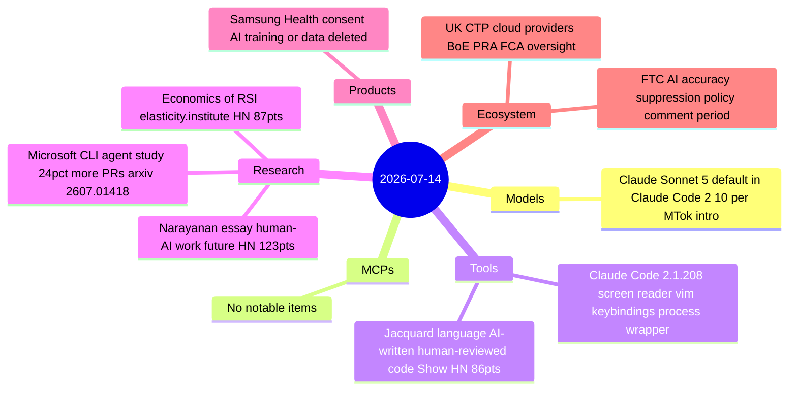
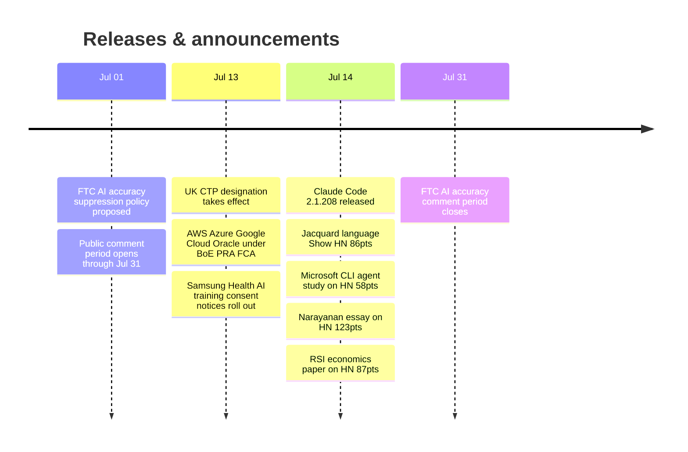

# AI Digest — 2026-07-14

> A relatively quiet day after the previous week's major model launches and privacy controversies — but the regulatory front remained active. The biggest story is the UK Bank of England, PRA, and FCA jointly placing AWS, Azure, Google Cloud, and Oracle under bank-grade prudential supervision as Critical Third Parties, the first time cloud AI infrastructure has been subject to financial-sector regulatory oversight. Close behind is Samsung Health's consent ultimatum: accept AI training use of your health data or the app permanently deletes it — a design choice drawing immediate comparisons to GDPR's explicit data rights and prompting HN to make it the day's top story. On the tooling research side, a Microsoft-authored arxiv paper offers the first large-scale field telemetry evidence that CLI coding agents (Claude Code and Copilot CLI) drove 24% more merged pull requests across tens of thousands of engineers over four months.

## Day at a glance

## Top stories

1. **UK places AWS, Azure, Google Cloud, Oracle under bank-grade regulatory oversight** — The Bank of England, PRA, and FCA jointly designated all four hyperscalers as Critical Third Parties effective July 13, requiring mandatory resilience tests, incident reporting, and subjecting them to potential financial penalties and service prohibitions. [→ details](ecosystem.md#uk-ctp-cloud-providers)
2. **Samsung Health: consent to AI training or your data is permanently deleted** — A consent prompt rolling out with Samsung Health's redesign requires users to allow AI training use of health records (step counts, sleep, medication, cycle data, treatments) or face full data deletion; became the top HN post on July 14. [→ details](products.md#samsung-health-ai-consent)
3. **Microsoft field study: CLI coding agents drove +24% merged PRs** — A four-month telemetry study of tens of thousands of Microsoft engineers found a 24% merged-PR lift for Claude Code and Copilot CLI adopters; adoption spread peer-to-peer, not top-down. [→ details](research.md#microsoft-cli-coding-agent-study)

## By the numbers

| Category   | Items | Highlight |
|------------|------:|-----------|
| Models     |     1 | Claude Sonnet 5: default in Claude Code, $2/$10 per MTok through Aug 31 |
| MCPs       |     0 | — |
| Tools      |     2 | Jacquard: effect-typed language for human review of AI-generated code |
| Research   |     3 | Microsoft study: 24% PR lift; Narayanan: work restructures, doesn't disappear |
| Products   |     1 | Samsung Health: AI training consent or data deletion |
| Ecosystem  |     2 | UK CTP designation · FTC AI accuracy policy proposal |

## Timeline (UTC)

## Files
- [Models](models.md)
- [MCPs](mcps.md)
- [Tools](tools.md)
- [Research](research.md)
- [Products](products.md)
- [Ecosystem](ecosystem.md)
