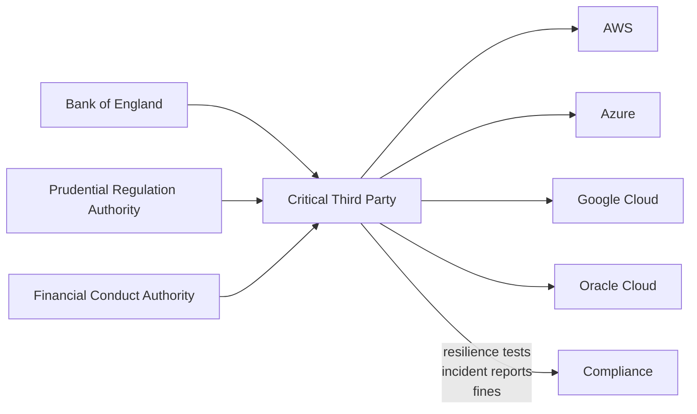

# Ecosystem — 2026-07-14

## UK designates AWS, Azure, Google Cloud, Oracle as Critical Third Parties under bank oversight 

**Source:** [FinTech Global](https://fintech.global/2026/07/13/uk-regulators-tighten-grip-on-cloud-giants-powering-finance/) · **Type:** regulation · **Time (UTC):** ~09:00 July 13

The UK Treasury, Bank of England (BoE), Prudential Regulation Authority (PRA), and Financial Conduct Authority (FCA) jointly designated Amazon Web Services, Microsoft Azure, Google Cloud Platform, and Oracle Cloud as Critical Third Parties (CTPs) effective July 13, 2026. The designation gives all three regulators authority to gather information from the providers, assess their resilience arrangements, and enforce CTP-specific rules. CTPs must now conduct mandatory resilience stress tests, perform regular self-assessments, and report major incidents to regulators. Enforcement tools range from binding directions to skilled-person reviews and financial penalties; as a last resort, regulators may temporarily prohibit a CTP from providing services to the financial sector. The designation responds to years of bank reliance on a small number of cloud suppliers: because so many institutions share the same handful of providers, an outage could simultaneously affect multiple firms and the payment infrastructure serving millions of consumers.

**Why it matters:** This is the first time cloud AI infrastructure has been brought under bank-grade prudential oversight. For engineers at fintechs and banks deploying AI workloads on these platforms, the new regime means upstream SLAs and incident-reporting timelines are now a regulatory matter — and can no longer be treated as purely commercial negotiation.

---

## FTC proposes policy statement: AI output steering may violate Section 5 

**Source:** [FTC press release](https://www.ftc.gov/news-events/news/press-releases/2026/07/ftc-seeks-public-comment-policy-statement-addressing-ai-accuracy) · **Type:** regulation · **Time (UTC):** — July 1

The Federal Trade Commission issued a proposed policy statement on July 1 targeting what it calls "suppression of accuracy in artificial intelligence systems" and is accepting public comment through July 31, 2026. The statement argues that AI companies secretly designed to pursue undisclosed ideological or commercial objectives — rather than serving user requests — may be deceiving consumers under Section 5 of the FTC Act. The FTC's rationale: consumers accept AI outputs without independent verification more than 90% of the time, so hidden steering represents an informational asymmetry that constitutes unfair or deceptive practice. Companies can avoid liability under a proposed disclosure safe harbour by making "clear, conspicuous, and adequate disclosures" that the system prioritizes objectives other than the user's stated request. Notably, the statement argues that Colorado's AI Act — which can push companies toward suppressing outputs to avoid disparate impact liability — is impliedly preempted by the federal regulatory scheme.

**Why it matters:** If finalized, the policy would require AI product teams to treat output-steering decisions (guardrails, tone tuning, topic restrictions) as potential disclosure obligations rather than purely internal product choices. The Colorado preemption argument, if sustained, would resolve a significant compliance tension for AI companies operating across states. Comment period closes July 31.

---
