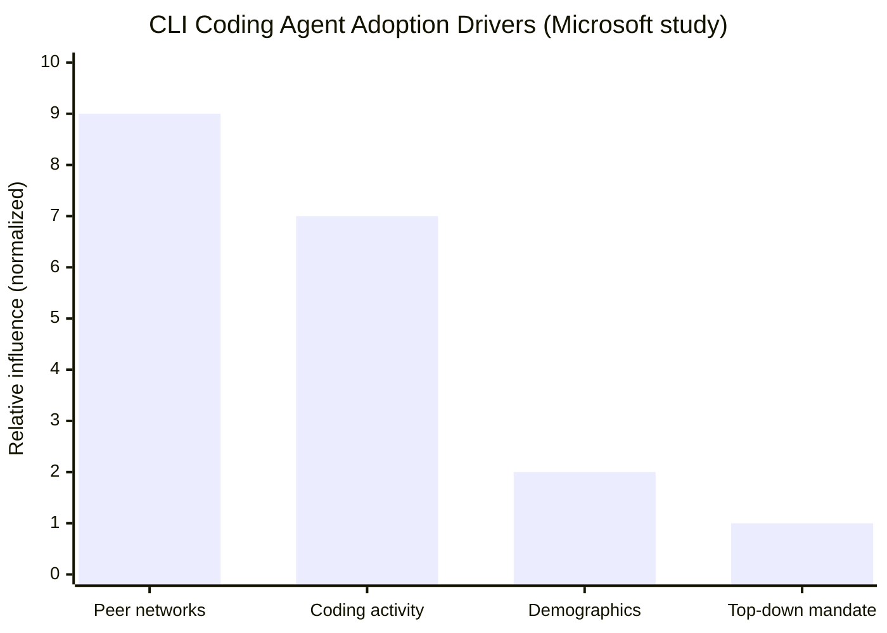

# Research — 2026-07-14

## Microsoft field study: CLI coding agents drove 24% more merged PRs 

**Source:** [arxiv 2607.01418](https://arxiv.org/abs/2607.01418) · **Type:** paper · **Time (UTC):** ~08:00 (HN posting)

Researchers at Microsoft (Murphy-Hill, Butler, Savelieva) published the first field study to use developer-level telemetry to measure the adoption and output impact of agentic command-line coding tools. The study tracked tens of thousands of Microsoft engineers during a four-month early-2026 rollout that offered both Claude Code and GitHub Copilot CLI as options. Key findings: first use spread primarily through peer networks rather than top-down mandates; retention correlated more strongly with existing coding activity levels than with demographics; and adopters merged roughly 24% more pull requests than comparable non-adopters over the study window. The authors flag a critical caveat: a merged PR is a proxy, not a guarantee of business value.

**Why it matters:** This is the largest telemetry-backed study of CLI coding agent adoption to date. The 24% PR-merge lift is a concrete productivity signal (not a survey estimate), and the peer-network adoption finding has direct implications for enterprise rollout strategy — tool visibility and social proof matter more than IT mandates.

---

## Arvind Narayanan: "What will be left for us to work on?" 

**Source:** [normaltech.ai](https://www.normaltech.ai/p/what-will-be-left-for-us-to-work) · **Type:** analysis · **Time (UTC):** ~11:00 (HN posting)

Princeton CS professor Arvind Narayanan published an essay arguing against both AI-eliminates-all-work alarmism and uncritical optimism, reaching 123 points and 139 comments on HN on July 14. His three main arguments: (1) viewing AI through diffusion-of-innovations theory shows adaptation lags invention by decades, and the gap between AI capability and actual deployment remains large due to reliability, regulation, and integration friction; (2) recursive self-improvement, humanlike capability, economic transformation, and superintelligence are four separate axes that don't advance in lockstep; (3) work restructures rather than disappears — effort shifts "from building systems to evaluating systems," elevating judgment and domain expertise while devaluing purely technical execution. The piece invokes historical precedents (ATMs in banking, electrification in factories) where employment grew despite automation.

**Why it matters:** Narayanan brings a measured empirical frame to a debate dominated by extreme positions. The specific observation that creativity remains "an unverifiable task" — limiting near-term automation of design and strategy work — is a useful heuristic for engineers thinking about which roles will persist.

---

## "The Economics of Recursive Self-Improvement" 

**Source:** [elasticity.institute](https://elasticity.institute/rsi-paper.pdf) · **Type:** paper · **Time (UTC):** ~13:00 (HN posting)

A paper titled "The Economics of Recursive Self-Improvement" was posted to Hacker News on July 14 and reached 87 points and 27 comments. The PDF is hosted at elasticity.institute and appears to apply economic modeling to the feedback dynamics of AI systems that participate in their own improvement — examining the market and growth-rate conditions under which RSI leads to qualitatively different outcomes. Full paper text was not accessible for detailed review. Parallel arxiv work (2607.07663, "Recursive Self-Improvement in AI: From Bounded Self-Refinement to Autonomous Research Loops") surveys 1,250 papers and distinguishes bounded self-refinement (convergent, already industrial) from open-ended RSI (remains constrained by grounding, collapse dynamics, and compute limits).

**Why it matters:** RSI economics is an emerging subfield; the HN traction suggests the developer community is actively tracking analytical frameworks for modeling AI growth trajectories, not just benchmark curves.

---
