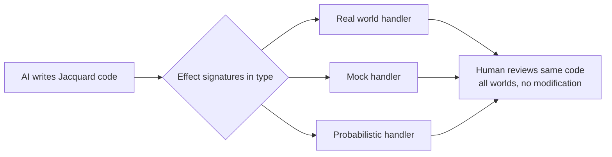

# Tools — 2026-07-14

## Claude Code 2.1.208 

**Source:** [Releasebot / Anthropic changelog](https://releasebot.io/updates/anthropic/claude-code) · **Type:** update · **Time (UTC):** ~00:00

Claude Code version 2.1.208 shipped today with a batch of accessibility and reliability improvements. New capabilities include a screen-reader mode activated via `claude --ax-screen-reader` (outputs plain text instead of TUI), vim insert-mode key-sequence remaps (e.g. `jj` → Escape), a `CLAUDE_CODE_PROCESS_WRAPPER` environment variable for corporate process-wrapping setups, and mouse-click support in fullscreen menus. The release also fixed a bug where background agent replies typed during failed delivery were silently lost — they are now saved and redelivered on restart. Markdown table rendering no longer causes memory bloat for tables exceeding 200 rows.

**Why it matters:** Screen reader support and vim keybindings remove two common friction points for accessibility users and terminal enthusiasts respectively. The background-agent delivery fix addresses a data-loss issue that could silently drop user instructions during flaky network conditions in long-running agentic sessions.

---

## Jacquard — a programming language for AI-written, human-reviewed code 

**Source:** [GitHub / jbwinters](https://github.com/jbwinters/jacquard-lang) · **Type:** release · **Time (UTC):** ~12:00

Jacquard is a new research programming language from FriendMachine designed for an era where models generate most code and humans review it. Its core premise: traditional languages hide critical runtime behavior from reviewers, so Jacquard encodes it in the type system. Function signatures explicitly declare which external effects (network, disk, etc.) a function may perform via syntax like `(text) ->{net} text`; unhandled capability calls throw at runtime, not silently. The language supports multi-world testing — the same program can run against real I/O, scripted responses, or probability models by swapping handlers without touching code. Programs are also fingerprinted by canonical structure, so formatting or comment edits don't trigger reruns. The release includes a CLI, standard library, native AOT compiler targeting C, and a testing framework called Warp. Appeared on HN Show HN with 86 points and 44 comments on July 14.

**Why it matters:** As AI-generated code proliferates, the bottleneck shifts to human review speed and confidence. Jacquard's explicit capability declarations let reviewers answer "what can this code touch?" from the signature alone rather than tracing call graphs — a structural response to a problem that currently requires tooling bolted on top of existing languages.

---
