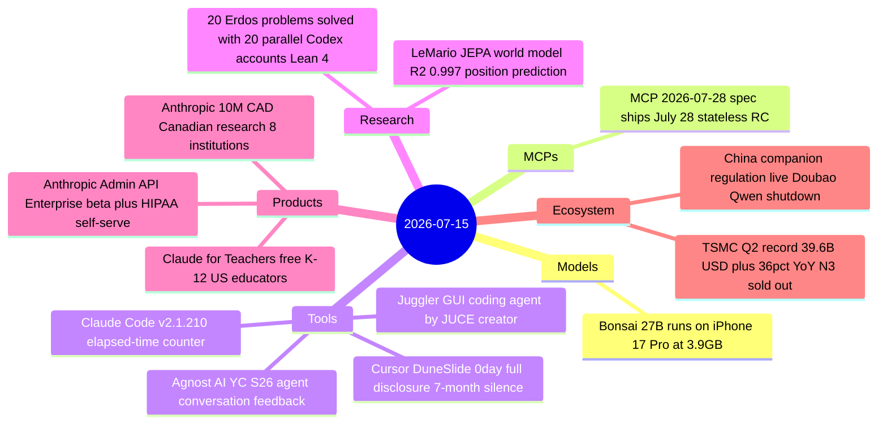

# AI Digest — 2026-07-15

> A relatively news-dense Tuesday shaped by three independent themes: edge AI crossed a new threshold with PrismML's Bonsai 27B fitting a capable 27B model into a 3.9 GB phone-ready binary; China's AI companion regulation went live today, forcing ByteDance and Alibaba to shut down persistent-agent features serving hundreds of millions of users; and a security researcher's full-disclosure write-up of a Cursor zero-click RCE (ignored for seven months by the vendor) landed on HackerNews with 350 points. Anthropic shipped a cluster of educator and enterprise products, TSMC confirmed AI chip demand is as strong as anyone claimed with record Q2 revenue, and the MCP 2026-07-28 specification is now 13 days from final.

## Day at a glance



## Top stories

1. **Bonsai 27B: first 27B-class model to run on a phone** — PrismML's 1-bit quantized Qwen3.6 27B fits in 3.9 GB and runs at 11 tok/s on an iPhone 17 Pro, reaching 90% of FP16 benchmark quality with Apache 2.0 licensing. [→ details](models.md#bonsai-27b)
2. **China AI companion regulation live — Doubao and Qwen agent features shut down** — China's Interim Measures for Anthropomorphic AI Interaction Services took effect today, forcing ByteDance and Alibaba to disable persistent-agent creation services; Qwen user data has no announced grace period. [→ details](ecosystem.md#china-companion-regulation-live)
3. **Cursor DuneSlide 0day: full disclosure after 7-month vendor silence** — Mindgard published an unpatched zero-click RCE in Cursor (git.exe path execution) after 197+ Cursor releases and no acknowledgment; separately, CVE-2026-50548/50549 (CVSS 9.8) were fixed in April's Cursor 3.0. [→ details](tools.md#cursor-duneslide-0day)

## By the numbers

| Category   | Items | Highlight |
|------------|------:|-----------|
| Models     |     1 | Bonsai 27B: 3.9 GB, 11 tok/s on iPhone 17 Pro, Apache 2.0 |
| MCPs       |     1 | MCP 2026-07-28 spec final in 13 days: stateless HTTP, MCP Apps, Tasks |
| Tools      |     4 | Cursor 0day; Juggler GUI agent; Claude Code v2.1.210; Agnost AI YC S26 |
| Research   |     2 | 20 Erdős problems via Lean 4 + parallel Codex; LeMario JEPA |
| Products   |     3 | Claude for Teachers; Admin API + HIPAA; $10M CAD Canadian research |
| Ecosystem  |     2 | China companion regulation live; TSMC Q2 $39.6B record |

## Timeline (UTC)

```mermaid
timeline
  title Releases and announcements
  00:00 : China companion regulation takes effect : Doubao and Qwen agent features disabled
  July 14 : Bonsai 27B released : Apache 2.0 on Hugging Face : PrismML developer-preview API opens
  July 14 : Claude for Teachers launched : Free for verified US K-12 educators through June 2027
  July 14 : Anthropic Admin API beta : Self-serve HIPAA configuration live
  July 14 : Anthropic 10M CAD : 8 Canadian research institutions receive Claude credits
  July 15 : Claude Code v2.1.210 : Elapsed-time counter : worktree and ultracode fixes
  July 15 : Cursor 0day full disclosure : Mindgard publishes unpatched git.exe RCE
  July 15 : Juggler alpha released : Show HN 228 pts : GUI coding agent by JUCE creator
```

## Files
- [Models](models.md)
- [MCPs](mcps.md)
- [Tools](tools.md)
- [Research](research.md)
- [Products](products.md)
- [Ecosystem](ecosystem.md)
