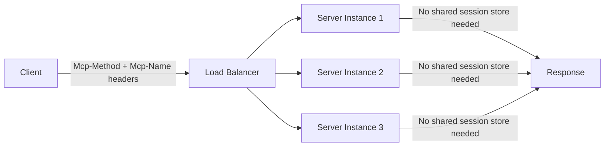

# MCPs — 2026-07-15

## MCP 2026-07-28 Specification: Final Ship in 13 Days 

**Source:** [Model Context Protocol Blog](https://blog.modelcontextprotocol.io/posts/2026-07-28-release-candidate/) · **Type:** update · **Time (UTC):** —

The release candidate for the MCP 2026-07-28 specification (issued May 21) enters its final validation window before the specification ships on July 28. This is the largest revision of the MCP protocol since its original launch, and it contains breaking changes that require SDK maintainers and implementers to act.

The core architectural change removes stateful session management: the `Mcp-Session-Id` header and the `initialize` handshake are gone. Every request now carries protocol version and client metadata in `_meta`, allowing any server instance to handle any request without sticky routing or shared session stores. Two new transport headers — `Mcp-Method` and `Mcp-Name` — let load balancers and rate-limiters route on the operation without inspecting the body. Alongside statelessness, two extensions land: **MCP Apps** lets servers ship sandboxed HTML UIs rendered by the client, and the **Tasks extension** formalizes long-running background work as an opt-in primitive (no longer core). List responses and resource reads now carry `ttlMs` and `cacheScope` fields modeled on HTTP `Cache-Control`, enabling client-side cache freshness logic. W3C Trace Context propagation is locked down in `_meta`, standardizing `traceparent`, `tracestate`, and `baggage` key names across SDKs.

Three features enter a formal deprecation track (12-month minimum before removal): **Roots** (use tool parameters or resource URIs instead), **Sampling** (integrate directly with LLM APIs), and **Logging** (use stderr or OpenTelemetry). The spec simultaneously introduces a formal extension governance model using reverse-DNS identifiers and independent versioning.

**Why it matters:** The stateless core change removes the primary scaling obstacle for production MCP deployments — server-side session state had forced sticky routing and shared stores in any multi-instance setup. Operators building high-availability MCP server clusters should test against the RC now; breaking changes will be final on July 28.

---
