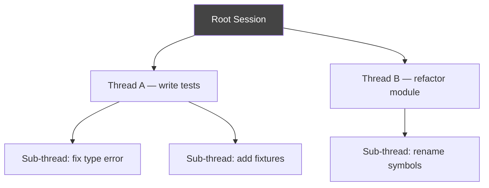

# Tools — 2026-07-15

## Claude Code v2.1.210 

**Source:** [Releasebot / Anthropic](https://releasebot.io/updates/anthropic/claude-code) · **Type:** update · **Time (UTC):** —

Version 2.1.210 adds a live elapsed-time counter displayed during long-running tool calls and tightens permission-warning copy. On the fix side: worktree isolation regression resolved; the `ultracode` keyword no longer fires on non-human input (automated triggers were unintentionally activating extended reasoning budgets); "job not found" errors during session transitions corrected; multiple tool-renderer crashes patched; MCP server synchronization problems fixed.

**Why it matters:** The elapsed-time display closes a UX gap for developers running agentic loops with slow external tools — previously there was no indication whether a long pause meant the model was working or had stalled. The `ultracode` keyword fix also prevents unexpected token cost inflation in CI/CD pipelines that pipe automated text into Claude Code.

---

## Juggler: GUI Coding Agent from the Creator of JUCE 

**Source:** [juggler.studio](https://juggler.studio/) · [Hacker News Show HN (228 pts)](https://news.ycombinator.com/item?id=48883305) · **Type:** release · **Time (UTC):** —

Julian Storer — who previously created the JUCE audio framework, the Tracktion DAW, and the Cmajor DSP language — released Juggler, an open-source GUI-first AI coding agent. Rather than presenting agent activity as a linear terminal log, Juggler structures each session as a navigable tree: any message can branch into a sub-thread, tool calls are individually inspectable, and context is editable in place. The application ships as a single Go binary with no Electron or Node.js dependencies, runs on macOS, Windows, and Linux, and supports Claude, OpenAI, and Ollama as LLM backends. Remote browser-based access and JavaScript plugin extensions are included. The main application is AGPL-3.0; the extensions API is Apache 2.0. This is an alpha/beta following roughly six months of development.

**Why it matters:** Juggler directly addresses a gap that developers working with complex multi-step agents hit: the standard linear-log UI makes it hard to inspect what context the model actually saw, where a branch went wrong, or how to re-run one sub-thread without resetting the entire session. A single statically compiled binary (no npm install) also lowers the setup threshold significantly compared to most agent tooling.

---

## Cursor DuneSlide 0day: 7-Month Silence Forces Full Disclosure 

**Source:** [Mindgard](https://mindgard.ai/blog/cursor-0day-when-full-disclosure-becomes-the-only-protection-left) · [Hacker News (350 pts)](https://news.ycombinator.com/item?id=48910676) · **Type:** security disclosure · **Time (UTC):** —

Mindgard AI Labs published a full-disclosure write-up after seven months of unanswered vendor contact. The issue: Cursor automatically discovers and executes any `git.exe` binary placed in a repository's root directory — without prompts, warnings, or sandbox enforcement — giving an attacker who can add a file to a repo (e.g., via a poisoned upstream dependency) arbitrary code execution under the victim's OS privileges with zero interaction required. The original disclosure was December 15, 2025; Cursor released 197+ versions in the intervening period with no response. Mindgard contacted the vendor via the security email address, HackerOne, LinkedIn, and direct researcher outreach, all without acknowledgment.

The separately documented DuneSlide flaws (CVE-2026-50548, CVE-2026-50549, both CVSS 9.8) in the terminal sandbox — disclosed earlier and fixed in Cursor 3.0 on April 2 — are related but distinct. CVE-2026-50548 exploits a non-default `working_directory` that gets added to the allow-list; CVE-2026-50549 tricks Cursor into falling back to trusting a shortcut's project-relative path that actually points outside the project. Every Cursor version before 3.0 is affected by those two CVEs.

**Why it matters:** The git.exe path-traversal issue published today remains unpatched. Cursor's maker reports that more than half the Fortune 500 use the tool. Any engineer who opens untrusted repositories (cloned from GitHub, received as a ZIP, etc.) in Cursor is exposed. Mitigations: review untrusted repository contents before opening, disable automatic terminal tool execution, or use an isolated VM/container for untrusted code.

---

## Agnost AI (YC S26): Structured Feedback from Agent Conversations 

**Source:** [Launch HN (77 pts)](https://news.ycombinator.com/item?id=48913763) · **Type:** launch · **Time (UTC):** —

Agnost AI (Y Combinator Summer 2026) launched a tool that extracts structured user feedback — feature requests, bug reports, sentiment signals — from AI agent conversation logs. The system ingests conversation transcripts and returns tagged, deduplicated feedback items that can be routed to product backlogs. Primary targets are teams shipping customer-facing agents who want to mine the resulting conversation data without manually reading transcripts.

**Why it matters:** As AI agents become the primary customer interface for many products, conversation logs replace traditional support tickets as the main source of product signal. Structured extraction from those logs is a nascent but practical tooling need.

---
