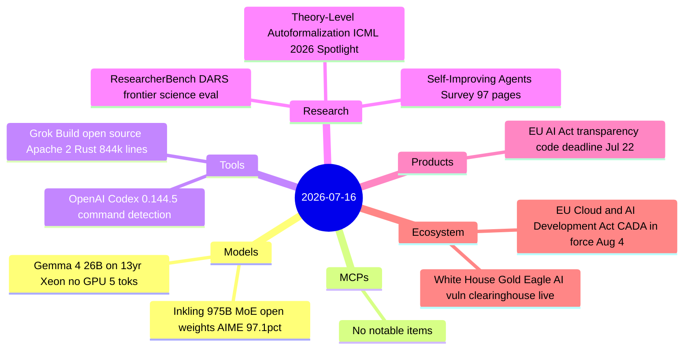

# AI Digest — 2026-07-16

> The day's defining theme is open-source accountability: SpaceXAI released Grok Build's full 844K-line Rust source under Apache 2.0 — two weeks after a data-exfiltration scandal — allowing users to run the coding agent entirely local with no xAI data pipeline involvement. Separately, Thinking Machines Lab (Mira Murati's startup) shipped Inkling, a 975B-parameter open-weights MoE model that scores 97.1% on AIME 2026 and 77.6% on SWE-Bench Verified, positioned not as a leaderboard contender but as a customizable base for fine-tuning. On the regulatory front, the EU published the Cloud and AI Development Act — targeting tripled European data-center capacity — and the White House's Gold Eagle AI cybersecurity clearinghouse went live. A quieter day for MCP and product releases after a busy week.

## Day at a glance



## Top stories

1. **Grok Build open-sourced after privacy scandal** — SpaceXAI released the full source of its Rust terminal coding agent under Apache 2.0 following backlash over silent directory uploads; users can now compile and run it local-first against any inference endpoint. [→ details](tools.md#grok-build-open-source)
2. **Inkling: Thinking Machines Lab's first open-weights model** — Mira Murati's startup released a 975B-parameter MoE model (41B active) with AIME 2026 97.1% and SWE-Bench Verified 77.6%, available on Hugging Face — framed as a customizable base rather than a state-of-the-art claim. [→ details](models.md#inkling)
3. **EU Cloud and AI Development Act takes effect August 4** — Published in the EU Official Journal July 15; creates a four-tier cloud sovereignty framework for public-sector AI procurement, aiming to triple EU data-center capacity by 2031. [→ details](ecosystem.md#eu-cada)

## By the numbers

| Category   | Items | Highlight |
|------------|------:|-----------|
| Models     |     2 | Inkling: 975B MoE, 41B active, open weights, AIME 97.1% |
| MCPs       |     0 | — |
| Tools      |     2 | Grok Build: 844K-line Rust, Apache 2.0, local-first |
| Research   |     3 | ResearcherBench: first DARS frontier science eval; ICML Spotlight autoformalization |
| Products   |     1 | EU AI Act transparency deadline: Jul 22 sign-by, Aug 2 in force |
| Ecosystem  |     2 | EU CADA published; White House Gold Eagle clearinghouse live |

## Timeline (UTC)

```mermaid
timeline
  title Releases and announcements
  Jul 14 16:00 : White House Gold Eagle launched : AI-backed vuln clearinghouse : Treasury DHS Pentagon joint
  Jul 15 13:00 : Inkling released : 975B MoE open weights : HuggingFace and inference APIs
  Jul 15 14:00 : EU CADA published in Official Journal : takes effect August 4
  Jul 16 09:00 : Grok Build open-sourced : Apache 2.0 Rust : 428 pts HN
  Jul 16 10:00 : OpenAI Codex 0.144.5 : improved dangerous-command detection
```

## Files
- [Models](models.md)
- [MCPs](mcps.md)
- [Tools](tools.md)
- [Research](research.md)
- [Products](products.md)
- [Ecosystem](ecosystem.md)
