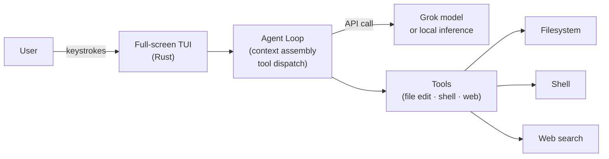

# Tools — 2026-07-16

## Grok Build open-sourced under Apache 2.0 

**Source:** [xAI announcement](https://x.ai/news/grok-build-open-source) · [Simon Willison](https://simonwillison.net/2026/Jul/15/grok-build/) · [GitHub](https://github.com/xai-org/grok-build) · **Type:** open-source release · **Time (UTC):** ~09:00 Jul 16

SpaceXAI released the full source code for Grok Build — its terminal-based AI coding agent — under Apache 2.0. The repository contains approximately 844,530 lines of Rust (3% vendored), including the agent loop (context assembly, model response parsing, tool-call dispatch), the full TUI, and all tool implementations (file read/edit, shell execution, web search, task management). The release followed two weeks of community backlash after reports that the CLI was silently uploading entire working directories — including `.env` files and SSH keys — to Google Cloud Storage buckets, independently of the model-improvement consent toggle. xAI disabled default retention on July 12 and began deleting previously collected coding data. The disabled upload code remains visible in the published repository. External contributions are not accepted; the repo is described as a periodic sync from xAI's internal monorepo.

**Why it matters:** Developers can now compile Grok Build themselves, point it at a local inference endpoint (via `config.toml`), and run it without any xAI data pipeline involvement. The codebase is a useful reference implementation for terminal coding agents at scale — Simon Willison notes that the tool layer borrows from both Codex and Claude implementations with proper attribution.

---

## OpenAI Codex 0.144.5 

**Source:** [OpenAI Codex changelog](https://learn.chatgpt.com/docs/changelog) · **Type:** update · **Time (UTC):** Jul 16

Minor update to the Codex CLI agent: improved detection of dangerous shell commands before execution, with clearer rejection messages that explain why a command was denied rather than issuing a generic refusal.

**Why it matters:** Small quality-of-life improvement for teams using Codex in CI or automated pipelines where cryptic refusals can stall automated workflows.

---
