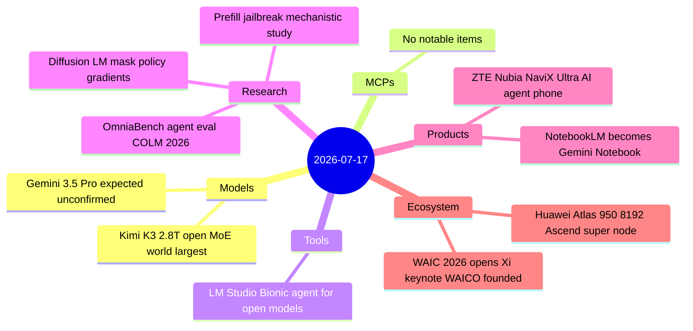

# AI Digest — 2026-07-17

> Today's biggest story is the opening of the 2026 World AI Conference in Shanghai, where President Xi Jinping delivered his first-ever WAIC keynote, announced the founding of WAICO (World Artificial Intelligence Cooperation Organization), and positioned China as a rival centre of global AI governance. Coinciding with the conference, Moonshot AI released Kimi K3 — the world's first open model in the 3-trillion-parameter class — with 2.8T total parameters, 1M native context, and weights releasing July 27; it landed at the top of Hacker News with 1,559 points. Huawei debuted the Atlas 950 super-node (8,192 Ascend 950DT chips on a domestic all-optical interconnect) as China's most detailed public answer to NVIDIA GPU clusters. Google's Gemini 3.5 Pro was widely expected to launch today but had not appeared in the official API changelog or Google blog as of digest time.

## Day at a glance



## Top stories

1. **WAIC 2026: Xi Jinping keynote, WAICO founded** — China's president appeared at a domestic AI conference for the first time, announcing a new permanent international AI body and multilateral development outreach — a structural move to lead global AI governance norms. [→ details](ecosystem.md#waic-2026-xi)
2. **Kimi K3: world's first open 3T-class model** — Moonshot AI's 2.8T-parameter MoE (16/896 active experts, 1M context) is the largest open-weights model ever and benchmarks at Elo 1,547 on Artificial Analysis; full weights arriving July 27 at $3/$15 per MTok. [→ details](models.md#kimi-k3)
3. **Huawei Atlas 950 debuts at WAIC** — An 8,192-card Ascend super-node on a domestic all-optical interconnect, built entirely without US components, is China's most capable publicly-disclosed AI compute infrastructure. [→ details](ecosystem.md#huawei-atlas-950)

## By the numbers

| Category   | Items | Highlight |
|------------|------:|-----------|
| Models     |     2 | Kimi K3: 2.8T params, 1M context, Elo 1547, weights Jul 27 |
| MCPs       |     0 | — |
| Tools      |     1 | LM Studio Bionic: privacy-first open-model agent, zero data retention |
| Research   |     3 | OmniaBench: cross-domain agent eval; prefill jailbreak mechanics |
| Products   |     2 | Gemini Notebook: code execution + Search integration; NaviX Ultra |
| Ecosystem  |     2 | WAIC: Xi keynote, WAICO; Huawei Atlas 950 super-node |

## Timeline (UTC)

```mermaid
timeline
  title Releases and announcements
  Jul 16 14:00 : Kimi K3 released : 2.8T open MoE : weights July 27
  Jul 16 15:00 : LM Studio Bionic released : AI agent for open models
  Jul 16 16:00 : NotebookLM rebrands Gemini Notebook : code execution : Search integration
  Jul 17 01:00 : WAIC 2026 opens in Shanghai : Xi Jinping keynote : WAICO founded
  Jul 17 02:00 : Huawei Atlas 950 debuts : 8192 Ascend 950DT chips
  Jul 17 02:30 : ZTE Nubia NaviX Ultra debuts at WAIC : AI agent smartphone
```

## Files
- [Models](models.md)
- [MCPs](mcps.md)
- [Tools](tools.md)
- [Research](research.md)
- [Products](products.md)
- [Ecosystem](ecosystem.md)
