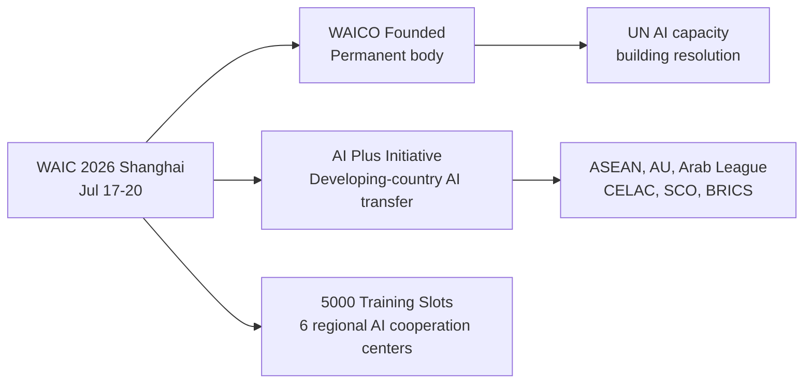

# Ecosystem — 2026-07-17

## WAIC 2026 Opens: Xi Keynote, WAICO Founded, 300+ Product Debuts 

**Source:** [Bloomberg](https://www.bloomberg.com/news/live-blog/2026-07-17/xi-jinping-ai-speech-china-waic-conference) · [CGTN](https://news.cgtn.com/news/2026-07-13/Xi-to-attend-and-address-opening-ceremony-of-2026-World-AI-Conference-1OKgsIkkofu/p.html) · **Type:** policy/event · **Time (UTC):** 01:00

China's 2026 World AI Conference opened in Shanghai with President Xi Jinping delivering his first-ever appearance at the annual summit. In his address, Xi called for AI development "for good, for positive, and for humanity" and announced three major international initiatives: the founding of WAICO (World Artificial Intelligence Cooperation Organization) as a permanent Shanghai-based body; an "AI Plus" International Cooperation Initiative aimed at developing-country technology transfer; and a commitment to provide 5,000 AI training and seminar slots to developing-country governments over the next five years, with regional AI application cooperation centres to be established with ASEAN, the African Union, the Arab League, CELAC, the SCO, and BRICS. China also promoted a UN General Assembly resolution on AI capacity building.

**Why it matters:** Xi's personal appearance — the first sitting Chinese president to keynote a domestic AI conference — signals that China is treating AI governance as a geopolitical priority, not a regulatory afterthought. WAICO's formation is a direct structural parallel to IEEE or ISO-style international bodies but under Chinese institutional leadership, positioning China to shape global AI norms through a multilateral governance mechanism it controls. The "5,000 slots" and development-country outreach are a soft-power play to build a coalition of aligned nations ahead of pending UN AI governance frameworks.

---

## Huawei Atlas 950: China's Largest Domestic AI Super-Node Debuts 

**Source:** [South China Morning Post](https://www.scmp.com/tech/article/3359733/huaweis-new-computing-cluster-worlds-first-ai-agent-phone-debut-china-ai-summit) · [Digitimes](https://www.digitimes.com/news/a20260714VL214/huawei-ascend-atlas-infrastructure-display.html) · **Type:** launch · **Time (UTC):** Jul 17 ~02:00

Huawei unveiled the Atlas 950 at WAIC 2026, a compute cluster built around 8,192 Ascend 950DT neural processing unit cards interconnected via UnifiedBus 2.0, an all-optical proprietary interconnect protocol. A single cabinet holds 64 cards; up to 8,192 cards connect at full bandwidth without traditional InfiniBand or NVLink bottlenecks. Huawei claims the system's aggregate throughput is equivalent to over 500,000 conventional cards at the same power envelope, without specifying the comparison baseline. The Atlas 950 was developed entirely without US-origin components following the 2020 export restrictions that cut Huawei off from TSMC and NVIDIA.

**Why it matters:** The Atlas 950 is the most technically detailed public data point on Huawei's compute stack since the Ascend 910C. If the 500K-card equivalent claim holds under independent testing, it would represent a viable domestic alternative for Chinese hyperscalers currently constrained by Nvidia H800 and H20 allocations. The all-optical interconnect at scale is also technically interesting as a potential path around NVLink-equivalent bandwidth bottlenecks that affect imported GPU clusters.

| Spec | Value |
|---|---|
| Chips | 8,192 × Ascend 950DT |
| Interconnect | UnifiedBus 2.0 (all-optical) |
| Cabinet unit | 64 cards |
| Claimed equivalent | 500,000+ conventional cards |
| Foreign components | None (domestic supply chain) |

---
