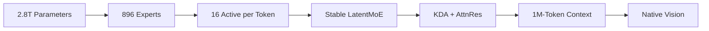

# Models — 2026-07-17

## Kimi K3: World's First Open 3T-Class Model 

**Source:** [Moonshot AI](https://www.kimi.com/blog/kimi-k3) · **Type:** release · **Time (UTC):** Jul 16 ~14:00

Moonshot AI released Kimi K3, a 2.8-trillion-parameter sparse Mixture-of-Experts model built on two novel architectural contributions: Kimi Delta Attention (KDA) and Attention Residuals (AttnRes). The model activates 16 of 896 experts per token using Stable LatentMoE, achieves roughly 2.5× better scaling efficiency versus Kimi K2, and supports a native 1-million-token context window with vision natively integrated. The model uses max thinking effort by default at launch, with Simon Willison's tests showing 13,241 of 16,658 output tokens consumed by reasoning chains. Per Artificial Analysis the model holds an overall Elo of 1,547 and currently leads the Frontend Code arena on Arena.ai.

**Why it matters:** At 2.8T parameters with Apache 2.0-licensed weights releasing July 27, K3 is the largest open-weights model ever shipped and the first open rival to proprietary frontier models on long-horizon coding and agentic tasks. Its pricing ($3/$15 per MTok) matches Claude Sonnet 5, a sharp jump from K2.6's $0.95/$4 structure, signalling Moonshot is positioning K3 at parity with top closed-model APIs, not undercutting them.

| Benchmark | Score | Notes |
|---|---|---|
| Terminal Bench 2.1 | 88.3 | Coding |
| Program Bench | 77.8 | Coding |
| Kimi Code Bench 2.0 | 72.9 | Coding |
| BrowseComp | 91.2 | Agentic |
| MCP Atlas | 84.2 | Agentic |
| DeepSearchQA F1 | 95.0 | Retrieval |
| MMMU-Pro | 81.6 | Vision |
| MathVision | 94.3 | Math |
| Artificial Analysis Elo | 1,547 | Private eval |

Pricing: $0.30/MTok (cache hit) · $3.00/MTok (input) · $15.00/MTok (output). Full model weights scheduled for July 27, 2026.

---

## Gemini 3.5 Pro — Expected Launch, Not Yet Confirmed 

**Source:** [Gemini API changelog](https://ai.google.dev/gemini-api/docs/changelog) · **Type:** watch · **Time (UTC):** —

As of digest time, Google has not published a model card, pricing page, or blog post for Gemini 3.5 Pro despite widespread third-party reporting of a July 17 general-availability target. The official Gemini API changelog's most recent entry is from July 6. Multiple sources report an architectural rebuild from scratch after engineers identified failures in recursive tool-calling and SVG generation on the original base model. Reported (unconfirmed) specs include a 2M-token context window, a Deep Think reasoning mode, and API pricing around $1.25/$10 per MTok. Google I/O committed to a "next month" release — the target has now slipped at least twice.

**Why it matters:** If launched, the combination of 2M context and Deep Think would place Gemini 3.5 Pro as a direct competitor to Fable 5 and GPT-5.6 Sol. The repeated delays signal either major architectural work or competitive timing caution given Kimi K3's release today and DeepSeek V4's July 24 stability date.

---
