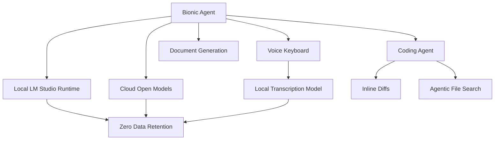

# Tools — 2026-07-17

## LM Studio Bionic: Privacy-First Agent for Open Models 

**Source:** [LM Studio Blog](https://lmstudio.ai/blog/introducing-lm-studio-bionic) · **Type:** release · **Time (UTC):** Jul 16 ~15:00

LM Studio shipped Bionic, a standalone AI agent application built specifically for open and local models, released separately from the LM Studio chat app. Bionic supports agentic coding (inline diffs, file search, debug loops), document and slide generation, and local voice input via an on-device transcription model. Users can mix local models with cloud-hosted open models and switch inference providers without changing the interface. LM Studio cites the recent capability crossover in open models — specifically Kimi K2.6 and GLM 5.2 — as the inflection point that made a production-grade open-model agent viable. The team commits to zero data retention and no training on user data.

**Why it matters:** Bionic is the first mass-market coding agent that runs the full agentic loop — code edits, file operations, voice input — entirely on local hardware with no vendor pipeline. For engineers in regulated industries or with data-residency requirements, it provides the task surface of Claude Code or Codex CLI without any cloud telemetry.

---
