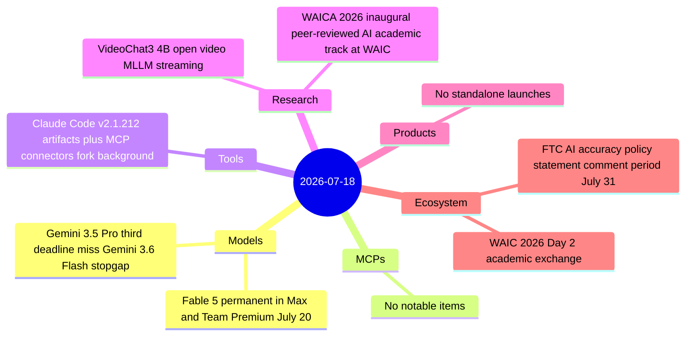

# AI Digest — 2026-07-18

> A lighter news day following the high-density WAIC opening and Kimi K3 launch of July 17. The top story is Anthropic's July 18 announcement that Claude Fable 5 will be permanently included in Max and Team Premium subscription plans starting July 20, ending six weeks of rolling extensions and capping a period of competitive pressure from Kimi K3 and other frontier rivals. The second story is Google's Gemini 3.5 Pro missing its third consecutive launch deadline, with registered model names suggesting a stopgap Gemini 3.6 Flash release in preparation. Rounding out the day: Claude Code v2.1.212 ships live-data artifact pages via MCP connectors, WAICA 2026 opens as the first peer-reviewed AI academic track at WAIC, and VideoChat3 offers a fully open 4B streaming video MLLM.

## Day at a glance



## Top stories

1. **Fable 5 goes permanent in Max & Team Premium** — Anthropic announced July 18 that Fable 5 will be included at 50% of limits in all Max and Team Premium plans starting July 20, with Pro users getting a $100 usage credit. Ends the six-week extension saga. [→ details](models.md#fable-5-permanent)
2. **Gemini 3.5 Pro misses third deadline** — Google missed its July 17 target for the third time and is now registering "Gemini 3.6 Flash" as a potential stopgap; prediction markets favour August 7 for GA. [→ details](models.md#gemini-35-pro-third-miss)
3. **Claude Code v2.1.212: live artifact data via MCP** — Artifacts can now pull each viewer's live data via their MCP connectors; `/fork` redesigned to open a background session instead of a subagent. [→ details](tools.md#claude-code-v2-1-212)

## By the numbers

| Category   | Items | Highlight |
|------------|------:|-----------|
| Models     |     2 | Fable 5 July 20 permanent plan inclusion |
| MCPs       |     0 | — |
| Tools      |     1 | Claude Code v2.1.212 artifacts+MCP connectors |
| Research   |     2 | WAICA inaugural academic AI conference; VideoChat3 open video MLLM |
| Products   |     0 | — |
| Ecosystem  |     2 | FTC AI accuracy policy comment; WAIC Day 2 |

## Timeline (UTC)

```mermaid
timeline
  title Releases & announcements
  01:00 : WAIC Day 2 opens — WAICA academic track inauguration
  ~Jul 16 : Claude Code v2.1.212 ships — artifacts + MCP connectors
  ~Jul 16 : VideoChat3 paper posted to arXiv
  ~Jul 16 : Gemini 3.5 Pro third deadline miss reported — Gemini 3.6 Flash stopgap floated
  Jul 18 : Anthropic tweets — Fable 5 permanent in Max and Team Premium from July 20
```

## Files
- [Models](models.md)
- [MCPs](mcps.md)
- [Tools](tools.md)
- [Research](research.md)
- [Products](products.md)
- [Ecosystem](ecosystem.md)
