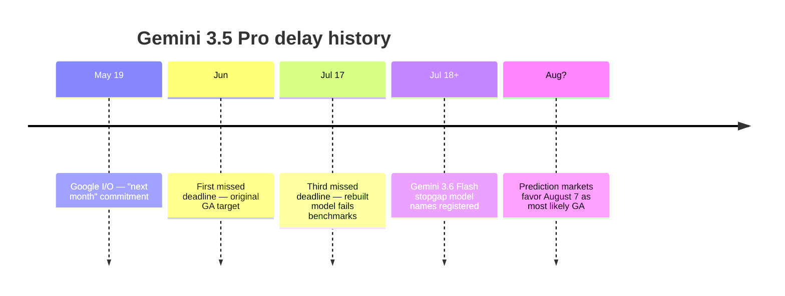

# Models — 2026-07-18

## Anthropic Confirms Fable 5 Permanent in Max & Team Premium from July 20 

**Source:** [@claudeai on X](https://x.com/claudeai/status/2078302415804379218) · **Type:** announcement · **Time (UTC):** Jul 18 (time unconfirmed)

After a six-week saga of extensions — original July 7 deadline, extended to July 12, then July 19 — Anthropic announced that Claude Fable 5 will be permanently included in Max and Team Premium subscription plans starting July 20, at 50% of those plans' existing usage limits. Pro and Team Standard subscribers retain access through usage credits and will receive a one-time $100 credit. Anthropic attributed the staged rollout to demand that was "challenging to predict," noting it has been expanding capacity in incremental steps. Separately, the baseline usage limits for Max and Team Premium plans are themselves dropping by a third on July 20, so "50% of limits" translates to roughly 33% of the previous baseline allowance.

**Why it matters:** The announcement ends the access uncertainty that has surrounded Fable 5 since its June export-control suspension and July 1 redeployment. For Max and Team Premium users, Fable 5 is now a durable plan feature rather than a promotional window, though the 50%-of-reduced-limits arrangement means heavy users will hit the cap sooner than before. The timing — a day after Kimi K3 launched as the world's largest open model with an Elo of 1,547 — suggests competitive pressure from both open-weight and closed-model rivals is influencing Anthropic's capacity commitments.

| Plan | Fable 5 access from July 20 |
|---|---|
| Max | Included at 50% of limits |
| Team Premium | Included at 50% of limits |
| Pro | Usage credits + one-time $100 credit |
| Team Standard | Usage credits + one-time $100 credit |
| Enterprise | Usage credits (seat-dependent) |

---

## Gemini 3.5 Pro Misses Third Deadline; Google Registers Gemini 3.6 Flash 

**Source:** [TechTimes](https://www.techtimes.com/articles/320736/20260716/rebuilt-gemini-35-pro-misses-third-deadline-google-eyes-stopgap-release.htm) · [Geeky Gadgets](https://www.geeky-gadgets.com/gemini-3-5-pro-delayed-again/) · **Type:** watch/delay · **Time (UTC):** reported Jul 16

The July 17 launch window for Gemini 3.5 Pro passed without a release, marking the model's third consecutive missed deadline after the original June target and a subsequent July date. Google DeepMind rebuilt the base model from scratch after engineers identified structural failures in recursive tool-calling and SVG generation; the rebuilt version has since failed to match GPT-5.6 in benchmark comparisons, extending the timeline. Geeky-Gadgets reports Google has registered model names including **Gemini 3.6 Flash** and **Gemini 3.5 Flash Light**, suggesting the company is preparing interim releases to maintain developer momentum while Pro development continues. Prediction markets now put a July 31 delivery at 81% and August 7 at 73% as the leading outcome.

**Why it matters:** Three consecutive delays, combined with the DeepMind talent exodus and $225B in Alphabet market cap erosion tied to the delay, are reshaping competitive dynamics. A stopgap Gemini 3.6 Flash release would preserve Google's presence in the mid-tier inference market but would leave the 2M-context + Deep Think flagship gap open, potentially widening Anthropic's and OpenAI's head start on frontier agentic workloads.

---
