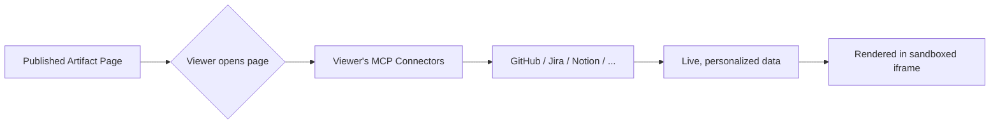

# Tools — 2026-07-18

## Claude Code v2.1.212: Artifacts Get MCP Connectors, /fork Goes Background 

**Source:** [Claude Code Docs — What's New](https://code.claude.com/docs/en/whats-new) · [AlternativeTo](https://alternativeto.net/news/2026/7/claude-code-artifacts-add-mcp-connector-support-for-dynamic-data/) · **Type:** release · **Time (UTC):** Jul 16

Claude Code v2.1.212 (released July 16, completing Week 29, v2.1.207–v2.1.212) shipped two headline features and a set of MCP performance improvements:

**Artifacts + MCP connectors**: Published artifact pages can now pull live data and take actions through each viewer's own MCP connectors when they open the page. A personal dashboard artifact showing a user's GitHub issues, Jira board, or Notion database now updates against the viewer's live credentials rather than static data baked in at publish time. Requires a select plan tier.

**`/fork` redesign**: `/fork` now copies the current conversation into a new background session (its own row in `claude agents`) while the original session stays active. The in-session subagent that `/fork` previously spawned is now called `/subtask`. The fork writes a pointer to the parent conversation and hydrates on read, reducing memory overhead.

**MCP performance**: Concurrent MCP startup for stdio servers; per-tool-call CPU overhead reduced up to 7× via tool-pool assembly caching at high tool counts.

**Why it matters:** The artifacts-plus-connectors feature transforms published pages from static snapshots into live, personalized dashboards — each viewer sees their own data, not a shared static view. For teams shipping internal dashboards or client-facing reporting tools through Claude Code, this removes the need for a separate backend to inject per-user data. The `/fork` overhaul is also meaningful for long agentic sessions: users can now branch a conversation mid-task without interrupting either thread.

---
