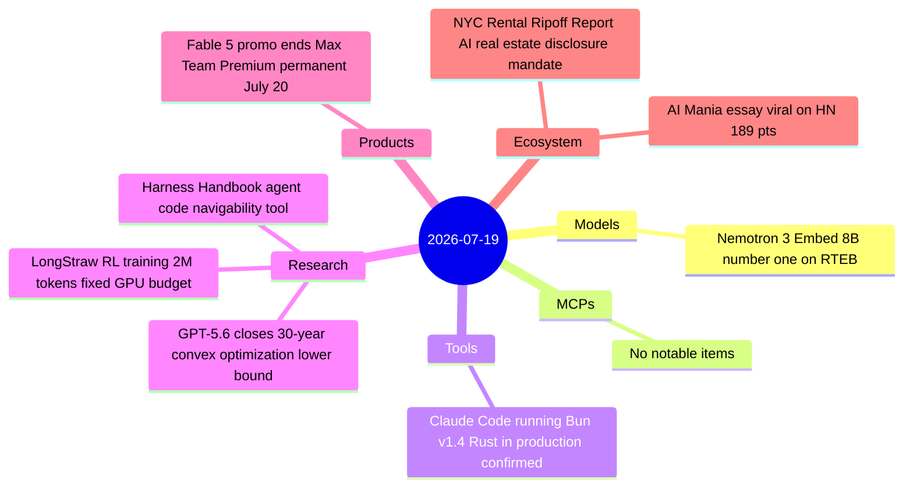

# AI Digest — 2026-07-19

> A lighter Sunday following a dense WAIC/Kimi K3/Fable 5 week. The day's biggest story is GPT-5.6 Sol closing a 30-year open gap in convex optimization lower bounds — a distinct and arguably harder result than the Cycle Double Cover graph-theory proof announced July 12. On the research front, two new arxiv papers address long-context RL training (LongStraw, 2M+ tokens on a fixed GPU budget) and agent-harness navigability (Harness Handbook). NVIDIA Nemotron 3 Embed 8B took the #1 slot on the RTEB retrieval benchmark this week, and Simon Willison confirmed Claude Code is shipping a Rust-based Bun v1.4.0 preview runtime in production. The Fable 5 promotional period ends tonight; Max and Team Premium users transition to permanent access at 50% limits starting July 20.

## Day at a glance



## Top stories

1. **GPT-5.6 closes 30-year convex optimization lower bound** — Guided by a crafted 10-page prompt, GPT-5.6 Sol proved that minimizing a convex Lipschitz function requires Ω(d²) evaluations, matching a 1990s upper-bound algorithm and closing a three-decade theoretical gap. [→ details](research.md#gpt56-convex-opt)
2. **Claude Code confirmed running Bun v1.4.0 preview on Rust** — Simon Willison's binary analysis of Claude Code v2.1.181 found 563 Rust source file paths and a Bun v1.4.0 preview runtime, revealing that production deployments are ahead of Bun's public release schedule. [→ details](tools.md#claude-code-bun-rust)
3. **NVIDIA Nemotron 3 Embed 8B takes #1 on RTEB** — An open embedding collection (OpenMDW-1.1) with an 8B checkpoint topping the Retrieval Text Embedding Benchmark at 78.46 NDCG@10, offering a credible open alternative to proprietary embeddings for RAG and agent memory. [→ details](models.md#nemotron-3-embed)

## By the numbers

| Category   | Items | Highlight |
|------------|------:|-----------|
| Models     |     1 | Nemotron-3-Embed-8B: #1 RTEB, 78.46 NDCG@10 |
| MCPs       |     0 | — |
| Tools      |     1 | Claude Code on Bun v1.4.0 preview / 563 Rust files |
| Research   |     3 | GPT-5.6 convex opt proof; LongStraw 2M-token RL; Harness Handbook |
| Products   |     1 | Fable 5 promo ends; Max/Team Premium permanent from July 20 |
| Ecosystem  |     2 | NYC AI real estate disclosure; AI Mania essay 189 HN pts |

## Timeline (UTC)

```mermaid
timeline
  title Releases & announcements
  Jul 15-17 : Nemotron 3 Embed 8B released, takes RTEB #1
  Jul 16 : NYC Rental Ripoff Report published by Mayor Mamdani
  Jul 18 : AI Mania essay published (Ludicity)
  Jul 19 00:00 : GPT-5.6 convex optimization result posted to Reddit, reaches HN front page
  Jul 20 06:59 : Fable 5 promo ends, Max/Team Premium permanent access begins
```

## Files
- [Models](models.md)
- [MCPs](mcps.md)
- [Tools](tools.md)
- [Research](research.md)
- [Products](products.md)
- [Ecosystem](ecosystem.md)
