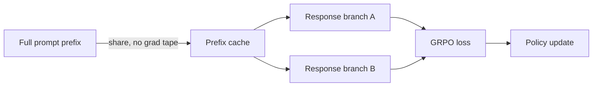

# Research — 2026-07-19

## GPT-5.6 closes 30-year convex optimization lower bound 

**Source:** [Reddit r/math → HN](https://news.ycombinator.com/item?id=48957779) · **Type:** result · **Time (UTC):** ~00:00

A researcher posted a proof — produced by GPT-5.6 Sol guided by a 10-page crafted prompt — that the time complexity for minimizing a convex Lipschitz function over d dimensions requires Ω(d²) function evaluations, matching a 30-year-old upper-bound algorithm from the 1990s and closing the theoretical gap. The HN thread reached 555 points. This is a lower-bound proof — establishing that no algorithm can fundamentally outperform the existing approach — distinct from the Cycle Double Cover graph-theory proof announced July 12.

**Why it matters:** Lower-bound proofs in optimization theory are notoriously harder than algorithm design (there is no easy "try harder" path). Closing a 30-year-old gap validates that AI-assisted proof search is reaching into genuinely hard open problems, not just cataloguing known results. The reliance on a carefully engineered 10-page prompt also shows that domain expertise in framing the problem remains essential.

---

## LongStraw: RL training beyond 2M tokens on a fixed GPU budget 

**Source:** [arXiv 2607.14952](https://arxiv.org/abs/2607.14952) · **Type:** paper · **Time (UTC):** —

Authors from Mind Lab present an execution framework enabling Group Relative Policy Optimization (GRPO) on sequences exceeding 2 million tokens, within a fixed GPU budget. The system achieves this by evaluating shared prompt prefixes without gradient tape and processing response branches sequentially. On H20 GPU clusters, experiments scaled to 2.1M positions on modest configs and 4.46M positions under stress conditions.

**Why it matters:** Inference can already handle million-token contexts, but RL post-training has been stuck around 256K tokens — forcing researchers to rely on length generalisation at deployment rather than training on realistic agent traces. LongStraw directly addresses this gap: agents that accumulate long observation and tool-call histories can now be trained on those same realistic trajectories, which should improve post-training fidelity for production agentic systems.

---

## Harness Handbook: navigating large evolving agent harnesses 

**Source:** [arXiv 2607.13285](https://arxiv.org/abs/2607.13285) · **Type:** paper · **Time (UTC):** —

Ruhan Wang et al. (Tencent Hunyuan + collaborators) introduce the Harness Handbook, which auto-generates a behaviour-centric map from agent harness source code via static analysis and LLM assistance. They also present Behaviour-Guided Progressive Disclosure (BGPD), a technique that reveals increasingly detailed implementation context as a developer (or an AI coding agent) needs it. The paper reports improved code-change planning efficiency and reduced token usage, particularly for scattered cross-module changes.

**Why it matters:** As agent systems grow beyond a single file, knowing which code to change for a desired behaviour change becomes the bottleneck — not the change itself. This is the first systematic tool targeting that navigability problem. Teams maintaining Claude Code, OpenCode, or similar large harnesses will recognise the pain point immediately.

---
