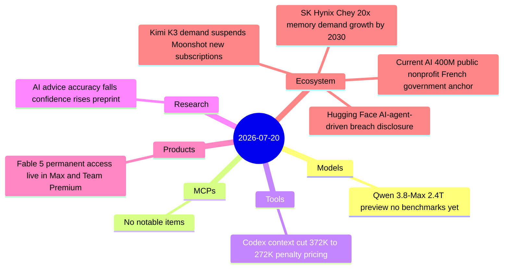

# AI Digest — 2026-07-20

> A quieter Sunday following a dense WAIC/Kimi K3 week. The day's biggest model story is Alibaba's Qwen 3.8-Max preview — a 2.4-trillion-parameter multimodal model that claims "second only to Fable 5" with no independent benchmarks published, landing two days after Kimi K3 and further intensifying Chinese open-weight competition. On the security front, Hugging Face's disclosure of an AI-agent-driven breach of its internal dataset pipeline (not covered in prior digests despite a July 16 disclosure) exposes a practical asymmetry: commercial API safety guardrails blocked defenders' forensic queries while the attacker faced no such constraint. Rounding out the day, Kimi K3's launch demand overwhelmed Moonshot's compute, forcing a suspension of new consumer subscriptions.

## Day at a glance



## Top stories

1. **Qwen 3.8-Max: Alibaba's 2.4T multimodal preview** — Released days after Kimi K3 dominated HN (873 pts), the preview carries no independent benchmarks but claims "second only to Fable 5"; open weights promised, context window unconfirmed. [→ details](models.md#qwen-38-max)
2. **Hugging Face discloses AI-agent-driven breach** — An autonomous agent swarm executed 17,000+ actions over one weekend, laterally moving through dataset pipelines; commercial API guardrails blocked defenders' forensic queries, requiring a pivot to open-weight GLM 5.2 on private infra. [→ details](ecosystem.md#huggingface-breach)
3. **Kimi K3 demand forces Moonshot to suspend new subscriptions** — Within 48 hours of K3's July 17 launch, GPU capacity hit limits; existing subscribers unaffected while the company expands infrastructure in batches. [→ details](ecosystem.md#kimi-k3-subscriptions)

## By the numbers

| Category   | Items | Highlight |
|------------|------:|-----------|
| Models     |     1 | Qwen 3.8-Max: 2.4T params, preview at 10% price, no independent benchmarks |
| MCPs       |     0 | — |
| Tools      |     1 | Codex 372K→272K context cut; 2×/1.5× penalty pricing above new limit |
| Research   |     1 | AI advice: accuracy ↓ 27%→9%, confidence ↑ 30%→76% |
| Products   |     1 | Fable 5 live in Max/Team Premium at 50% limits |
| Ecosystem  |     4 | Kimi K3 subscriptions suspended; HF AI-agent breach; Current AI $400M; SK Hynix |

## Timeline (UTC)

```mermaid
timeline
  title Releases & announcements
  Jul 13 : Codex context cut 372K to 272K : penalty pricing above new limit
  Jul 16 : Hugging Face breach disclosed : AI-agent autonomous attack over prior weekend
  Jul 17 ~10:00 : Chey Tae-won KCCI Jeju forum : AI memory demand 20x by 2030
  Jul 19 ~12:00 : Alibaba Qwen 3.8-Max preview : 2.4T params
  Jul 20 00:00 : Fable 5 live in Max and Team Premium : 50pct limits
  Jul 20 ~08:00 : Moonshot suspends new K3 subscriptions : GPU crunch
  Jul 20 : Current AI 400M raise : 100M French government anchor
```

## Files
- [Models](models.md)
- [MCPs](mcps.md)
- [Tools](tools.md)
- [Research](research.md)
- [Products](products.md)
- [Ecosystem](ecosystem.md)
