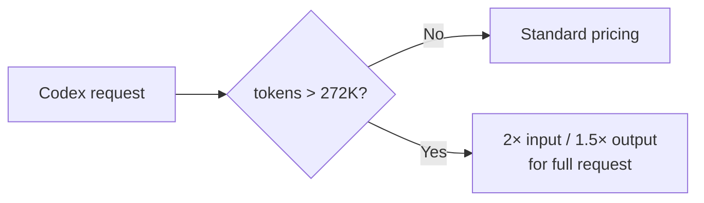

# Tools — 2026-07-20

## OpenAI Codex context window cut from 372K to 272K 

**Source:** [Hacker News #48965850](https://news.ycombinator.com/item?id=48965850) · [AI Weekly](https://aiweekly.co/alerts/openai-codex-cuts-gpt-56-context-window-from-372k-to-272k) · **Type:** update · **Time (UTC):** Jul 13 (trending Jul 19–20, 340 HN pts)

As of July 13, OpenAI's Codex agent surface silently reduced the effective context window for GPT-5.6 (Sol, Terra, Luna) from 372,000 to 272,000 tokens. The change was discovered through billing anomalies rather than any release note. Requests that exceed the 272K threshold incur a 2× input / 1.5× output pricing surcharge applied to the entire request — a penalty tier, not a hard cutoff. GPT-5.6's published 1.05M context window is unaffected for direct API users; the 272K cap applies to the Codex surface specifically, where bundled system-prompt overhead further reduces available user context. A GitHub issue (#32806) documents a subsequent reduction to 258K for Sol specifically, suggesting the limits are still in flux.

**Why it matters:** Agent harnesses and CI-integrated coding workflows that assume Codex's previous 372K limit will silently incur penalty billing on every request above 272K. Teams should audit `max_tokens` and `context_length` configs in any Codex-backed workflow and cap input at 272K, or migrate long-context tasks to direct API access. The lack of advance notice means this is already affecting production billing.

---
