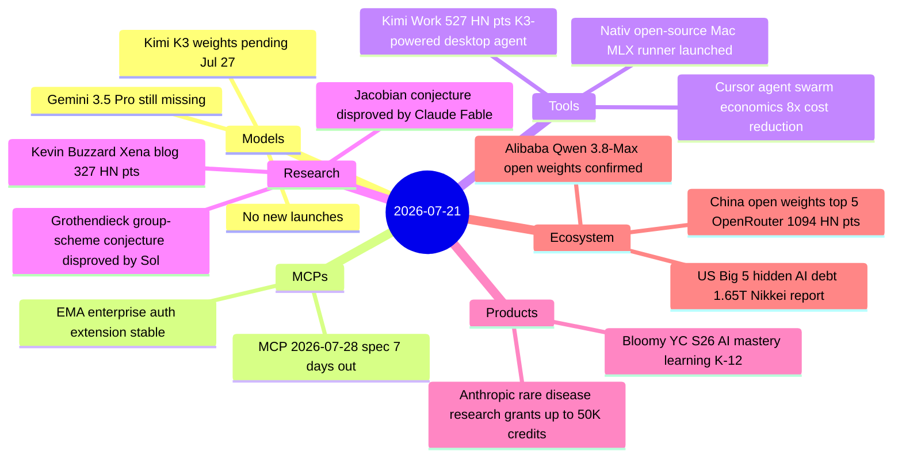
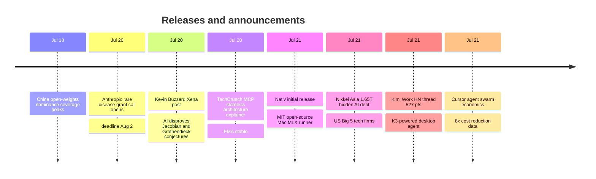

# AI Digest — 2026-07-21

> Today's biggest story is mathematical: Kevin Buzzard's Xena Project post (327 HN points) documents that Claude Fable 5 and GPT-5.6 Sol have found and formally verified — in the Lean proof assistant — counterexamples to both the Jacobian conjecture (open since 1939) and a conjecture of Grothendieck's, a qualitative shift in what AI systems can contribute to mathematics. The day's structural story is a 1,094-point HN thread arguing that China's open-weight AI strategy has achieved market dominance: Chinese labs now hold the top five spots on OpenRouter by weekly token usage and 41% of Hugging Face downloads, directly threatening the per-token revenue model of US frontier labs. Rounding out the day: Cursor published quantified agent swarm economics (8× cost reduction by routing execution to cheaper models), Moonshot's Kimi Work desktop agent drew 527 HN points following its K3 upgrade, Nativ launched as an MIT-licensed macOS runner for local frontier models, and Nikkei Asia reported that five US tech giants hold $1.65T in off-balance-sheet AI commitments — exceeding their total declared book debt.

## Day at a glance

## Top stories

1. **Claude Fable and Sol formally disprove two major math conjectures** — AI systems found and Lean-verified counterexamples to both the Jacobian conjecture (1939) and a Grothendieck group-scheme conjecture; machine-checked proofs eliminate the "plausible but wrong" failure mode of prior AI math claims. [→ details](research.md#math-counterexamples)
2. **China's open-weights AI strategy is winning** — Two converging HN threads (1,094 and 599 points) document that Chinese models occupy the top five spots on OpenRouter by weekly token usage, with Xi Jinping's WAIC statement directly prompting Alibaba to confirm Qwen 3.8-Max will release as open weights. [→ details](ecosystem.md#china-open-weights)
3. **US Big 5 carry $1.65T in hidden AI infrastructure debt** — Nikkei Asia analysis finds Alphabet, Microsoft, Amazon, Meta, and Oracle collectively hold AI-related off-balance-sheet commitments 8× larger than four years ago and exceeding their total declared book debt. [→ details](ecosystem.md#big-tech-hidden-debt)

## By the numbers

| Category   | Items | Highlight |
|------------|------:|-----------|
| Models     |     0 | Quiet; K3 weights Jul 27, Gemini 3.5 Pro still delayed |
| MCPs       |     1 | MCP stateless spec + EMA stable, 7 days to final release |
| Tools      |     3 | Nativ MIT launch; Kimi Work K3 upgrade; Cursor 8× agent cost reduction |
| Research   |     1 | Jacobian + Grothendieck conjectures Lean-verified by AI |
| Products   |     2 | Anthropic rare disease grants; Bloomy YC S26 launch |
| Ecosystem  |     2 | China open-weight dominance; $1.65T US tech hidden AI debt |

## Timeline (UTC)

## Files
- [Models](models.md)
- [MCPs](mcps.md)
- [Tools](tools.md)
- [Research](research.md)
- [Products](products.md)
- [Ecosystem](ecosystem.md)
