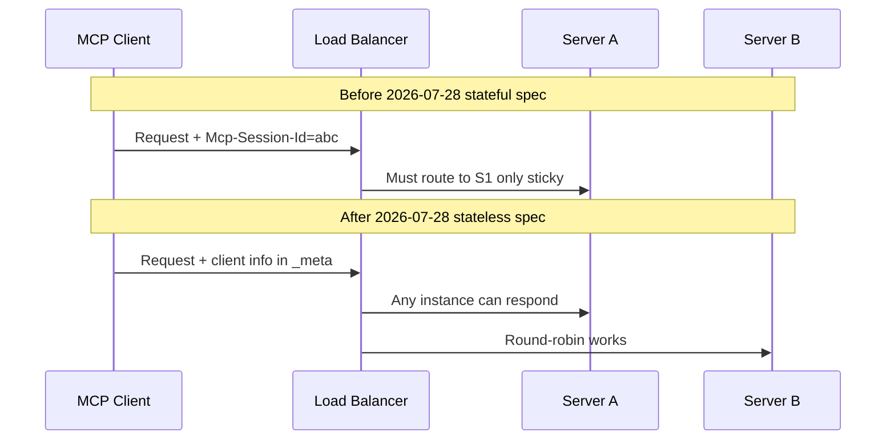

# MCPs — 2026-07-21

## MCP 2026-07-28 spec enters final week: stateless HTTP and EMA now stable 

**Source:** [TechCrunch](https://techcrunch.com/2026/07/20/ais-most-important-protocol-is-getting-a-little-bit-easier-to-use/) · [MCP blog RC post](https://blog.modelcontextprotocol.io/posts/2026-07-28-release-candidate/) · [InfoQ](https://www.infoq.com/news/2026/07/mcp-ema-enterprise-auth/) · **Type:** protocol update · **Time (UTC):** Jul 20 ~10:00

The MCP 2026-07-28 final specification publishes in seven days. TechCrunch ran a practitioner-facing explainer on July 20 focused on the biggest operational change: **session state is eliminated**. The current spec requires every server to track an `Mcp-Session-Id` per client connection; in load-balanced deployments this forces sticky sessions, shared session stores, and per-request routing complexity. The new spec moves client metadata into `_meta` on every request, making each request self-contained. Any server instance behind a plain round-robin load balancer can now handle any MCP request.

Separately, the **Enterprise-Managed Authorization (EMA)** extension reached stable status this week. EMA gives organizations a centralized identity-provider-based access control layer over MCP servers, aligned with OAuth 2.0 and OpenID Connect. Anthropic, Microsoft, and Okta are listed as initial adopters.

What is deprecated as of 2026-07-28: Roots, Sampling, and Logging move to deprecated status with a 12-month minimum removal window. Tier 1 SDKs are expected to ship support within the 10-week validation window before the July 28 release.

**Why it matters:** The stateless change removes the largest operational barrier to large-scale MCP deployments — no more sticky sessions or shared session stores for remote servers. With EMA stable, the two biggest enterprise blockers (operational complexity and centralized access control) are resolved in one release. Teams that deferred MCP adoption for scaling reasons have a clear upgrade path.

---
