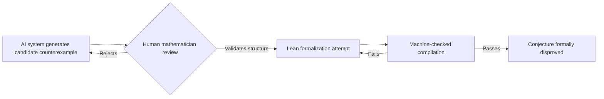

# Research — 2026-07-21

## AI systems formally verify counterexamples to two landmark mathematical conjectures 

**Source:** [Kevin Buzzard / Xena Project](https://xenaproject.wordpress.com/2026/07/20/human-mathematicians-are-being-outcounterexampled/) · [HN thread — 327 pts](https://news.ycombinator.com/item?id=48983382) · **Type:** technical blog / formal mathematics · **Time (UTC):** Jul 20 ~08:00

Kevin Buzzard, the mathematician leading the Lean formalization Xena project, published a post cataloguing a pattern emerging over the past two months: AI systems are finding counterexamples to long-standing mathematical conjectures that human mathematicians failed to disprove. Three results are documented:

| Conjecture | Open since | AI system | Formal verification |
|---|---|---|---|
| Erdős Unit Distance | ~1946 | ChatGPT (GPT-5.6 Sol) | 1.2M-line Lean file |
| Grothendieck group-scheme | ~1970s | GPT-5.6 Sol | 1,076-line Lean file (formalized by Claude Fable) |
| Jacobian conjecture | 1939 | Claude Fable 5 | Lean file by Paul Lezeau, DeepMind |

**Grothendieck result:** The conjecture held that every finite free group scheme of order n is killed by n. Sol found a group scheme of order 4 not killed by 4. Claude Fable then formalized the counterexample into a 1,076-line Lean proof file that compiles successfully, providing machine-checked verification.

**Jacobian conjecture:** Open since 1939, this asks whether a polynomial map ℂⁿ → ℂⁿ with constant nonzero Jacobian determinant always has a polynomial inverse. Claude Fable 5 — working with a mathematician at Anthropic — produced a degree-7 polynomial counterexample in three variables. Paul Lezeau (DeepMind) then formalized it manually in Lean for the Formal Conjectures repository. The HN thread (327 points) centers debate on whether credit goes to the AI system or the human mathematician working with it; the blog post takes the position that the distinction is becoming less meaningful in practice.

**Why it matters:** These are the first AI-contributed mathematical results verified not by peer review but by machine-checked formal proof in Lean. Lean verification eliminates the main failure mode of previous AI math claims — plausible-but-subtly-wrong arguments that passed human inspection. For engineers, this demonstrates that frontier models (Fable 5, Sol) can reason in formal systems at expert level. The practical implication for theorem-proving tooling and formal verification in software is direct.

---
