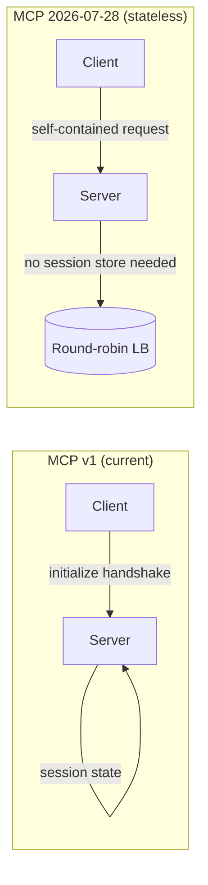

# MCPs — 2026-07-22

## MCP 2026-07-28 SDK Betas Released 

**Source:** [MCP Blog](https://blog.modelcontextprotocol.io/posts/sdk-betas-2026-07-28/) · **Type:** release · **Time (UTC):** Jul 22 ~08:00

Beta SDKs for the 2026-07-28 MCP specification release candidate are now available in Python, TypeScript, Go, and C#, completing the implementation layer needed for community migration ahead of the July 28 final spec. Key changes per language:

- **Python (v2 / `mcp[cli]==2.0.0b1`):** `FastMCP` renamed to `MCPServer`; decorator API unchanged; servers auto-negotiate both protocol versions.
- **TypeScript (v2):** Monolith split into `@modelcontextprotocol/server` and `@modelcontextprotocol/client`; Standard Schema adopted for tool validation; a codemod handles mechanical migration.
- **Go (v1.7.0-pre.1):** Stateless mode is opt-in; no API restructuring.
- **C# (2.0.0-preview.1):** Backward-compatible with stable v1 APIs.

All clients maintain fallback to the legacy initialize handshake when reaching v1 servers, preserving interoperability through the deprecation window. New protocol features in scope: stateless core (no session state), Multi Round-Trip Requests (MRTR) for mid-call UI interaction, routable transport headers (`Mcp-Method`), and tightened OAuth/OIDC authorization.

**Why it matters:** With 22,000+ MCP servers already in the wild, the betas give the ecosystem six days to validate migrations before the spec finalizes; the stateless shift removes the sticky-session requirement that has been the main barrier to running MCP servers behind standard load balancers.

---
