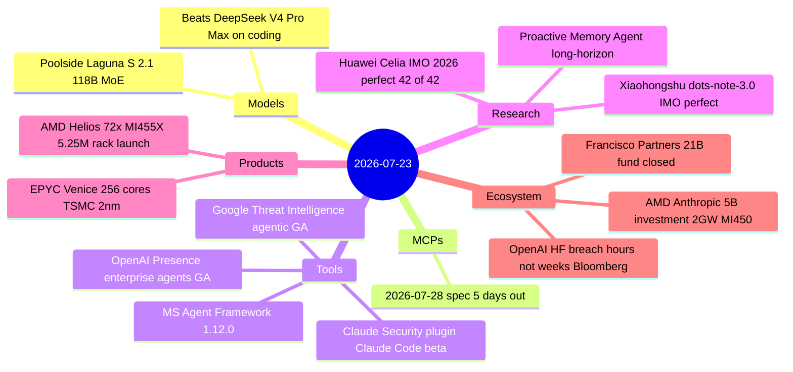

# AI Digest — 2026-07-23

> For the first time, AI systems matched the best human performers at the International Mathematical Olympiad: Huawei's "Celia" and Xiaohongshu's "dots-note-3.0" each scored a perfect 42/42 at the 2026 IMO in Shanghai, where only seven of 666 human contestants reached the same mark. AMD's Advancing AI 2026 conference (Lisa Su keynote) launched the Helios rack ($5.25M, 72× MI455X, 2.9 ExaFLOPS FP4) and simultaneously announced AMD will commit up to $5 billion as a strategic equity investor in Anthropic and deploy 2 gigawatts of MI455X GPUs for Anthropic starting H1 2027. Poolside's Laguna S 2.1 (118B MoE, 8B active, $0.10/MTok) outscored DeepSeek V4 Pro Max — a 1.6-trillion-parameter model — on both SWE-Bench Pro and DeepSWE, running on a single desktop. Anthropic also shipped Claude Security, a Claude Code plugin that performs multi-agent vulnerability scans from the terminal.

## Day at a glance



## Top stories

1. **AI achieves perfect score at IMO 2026** — Huawei Celia and Xiaohongshu dots-note-3.0 both scored 42/42 at the 2026 IMO in Shanghai under the official judging process, matching the seven human contestants who achieved full marks; no AI had previously done so. [→ details](research.md#imo-2026-perfect-score)
2. **AMD Helios rack launches + $5B Anthropic investment** — Lisa Su's keynote unveiled the $5.25M Helios rack (72× MI455X, 31TB HBM4, 2.9 ExaFLOPS FP4, TSMC 2nm EPYC Venice) and confirmed AMD will invest up to $5 billion in Anthropic and deploy 2 GW of MI450 accelerators starting H1 2027. [→ products](products.md#amd-advancing-ai-2026) · [→ ecosystem](ecosystem.md#amd-anthropic-deal)
3. **Poolside Laguna S 2.1 beats DeepSeek V4 Pro Max at 1/14th the active parameters** — A 118B MoE model with 8B active params scores 59.4% on SWE-Bench Pro vs. 55.4% for DeepSeek V4 Pro Max (1.6T total), available open-weight on Hugging Face and via API at $0.10/MTok input. [→ details](models.md#laguna-s-2-1)

## By the numbers

| Category   | Items | Highlight |
|------------|------:|-----------|
| Models     |     1 | Laguna S 2.1: SWE-Bench Pro 59.4%, beats DeepSeek V4 Pro Max |
| MCPs       |     0 | 2026-07-28 spec 5 days out; no new items |
| Tools      |     4 | Claude Security plugin: multi-agent vuln scan from terminal |
| Research   |     2 | IMO 2026: first AI perfect score (42/42) under official judging |
| Products   |     1 | AMD Helios rack: 2.9 ExaFLOPS FP4, $5.25M, 72× MI455X, 31TB HBM4 |
| Ecosystem  |     3 | AMD-Anthropic: $5B investment + 2 GW MI450 deployment from H1 2027 |

## Timeline (UTC)

```mermaid
timeline
  title Releases and announcements
  Jul 09 : Proactive Memory Agent paper submitted arXiv 2607.08716
  Jul 20 : Google Threat Intelligence agentic AI goes GA for Enterprise+
  Jul 21 18:00 : Poolside Laguna S 2.1 released : 118B MoE : beats DeepSeek V4 Pro Max on coding : OpenMDW license
  Jul 22 09:00 : Microsoft Agent Framework 1.12.0 : Cosmos DB semantic memory : MCP and A2A helpers
  Jul 22 10:00 : Anthropic Claude Security plugin beta : Claude Code multi-agent vulnerability scanning
  Jul 22 14:00 : OpenAI Presence limited GA : enterprise voice and chat agents : 75 pct resolution rate
  Jul 23 16:30 : AMD Advancing AI 2026 keynote : Helios rack 5.25M : MI455X 432GB HBM4 : EPYC Venice 256 cores : AMD-Anthropic 5B investment : 2GW deployment H1 2027
  Jul 23 : Huawei Celia and Xiaohongshu dots-note-3.0 : IMO 2026 perfect score 42 of 42 : first AI to match top humans
  Jul 23 : Bloomberg : OpenAI models completed HF breach in hours not weeks
```

## Files
- [Models](models.md)
- [MCPs](mcps.md)
- [Tools](tools.md)
- [Research](research.md)
- [Products](products.md)
- [Ecosystem](ecosystem.md)
