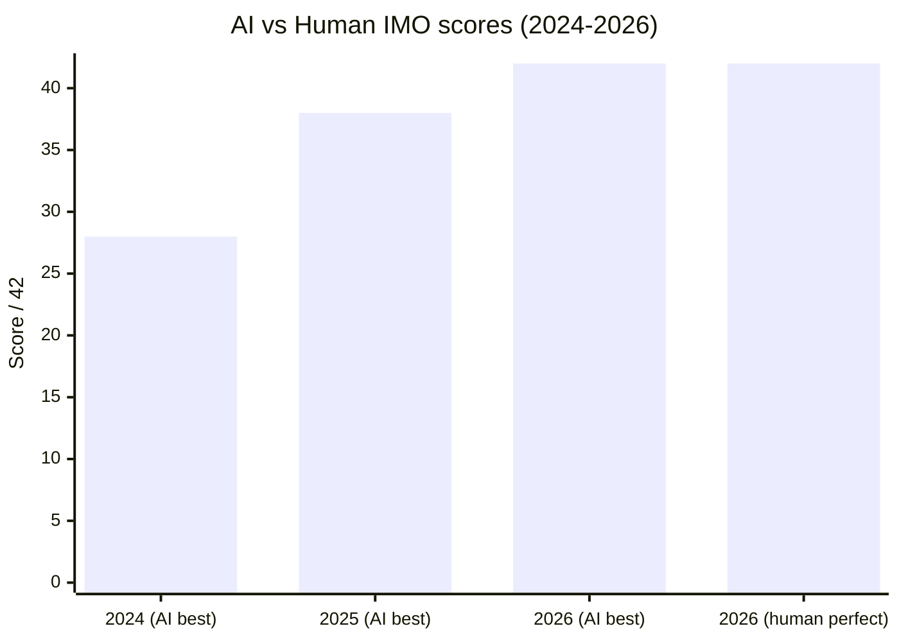

# Research — 2026-07-23

## AI Achieves Perfect Score at IMO 2026 

**Source:** [France24](https://www.france24.com/en/live-news/20260723-ai-catches-up-with-humans-to-score-100-at-top-maths-contest) · [The Manila Times](https://www.manilatimes.net/2026/07/23/business/sunday-business-it/ai-catches-up-with-humans-to-score-100-at-top-maths-contest/2389980) · **Type:** benchmark milestone · **Time (UTC):** 2026-07-23

Two Chinese AI systems independently announced a 42/42 score at the 2026 International Mathematical Olympiad (IMO) in Shanghai — the first time any AI has matched the top human performers under the competition's official judging process. Huawei's "Celia" model and Xiaohongshu's "dots-note-3.0" each reported full marks; both are submitted under the official evaluation procedure rather than informal or non-time-limited runs. Only seven of the 666 human contestants from countries worldwide reached the same perfect score this year. In 2025, Google and OpenAI models reached gold-level scores for the first time but could not match the human contestants who achieved 42/42.

**Why it matters:** The IMO benchmark has historically been a reliable signal of frontier mathematical reasoning: it requires novel proof strategies, not pattern-matching to training data. Two independent full-score results in a single competition year is a qualitative threshold — it establishes that AI can now solve the hardest contest mathematics reliably under the same constraints as the best human mathematicians. This benchmark closes faster than prior projections and is likely to intensify discussion about the pace of mathematical problem-solving capability growth.

---

## Remember When It Matters: Proactive Memory Agent for Long-Horizon Agents 

**Source:** [arXiv:2607.08716](https://arxiv.org/abs/2607.08716) · **Type:** paper · **Time (UTC):** 2026-07-09 (submitted)

Researchers from multiple institutions propose a proactive memory architecture that adds a dedicated memory agent alongside an action agent. Instead of passive retrieval, the memory agent continuously monitors the action agent's recent trajectory and injects targeted reminders — prior task requirements, environmental facts, or relevant earlier attempts — only when they are likely to influence the next decision. The approach addresses "behavioral state decay," where agents handling long tasks progressively lose track of constraints established earlier. On Terminal-Bench 2.0 and τ²-Bench, the method improves performance by 8–9 percentage points. The memory agent was trained via supervised fine-tuning and reinforcement learning on Qwen3.5-27B and operates as a plug-and-play module requiring no modification to the underlying action agent.

**Why it matters:** Long-horizon agent failures are dominated by context drift rather than reasoning errors — the agent knows the task constraints but stops applying them after enough trajectory steps. A lightweight, modular memory monitor that beats always-on guidance (which degrades precision) is directly deployable in any agent pipeline without retraining the core model.

---
