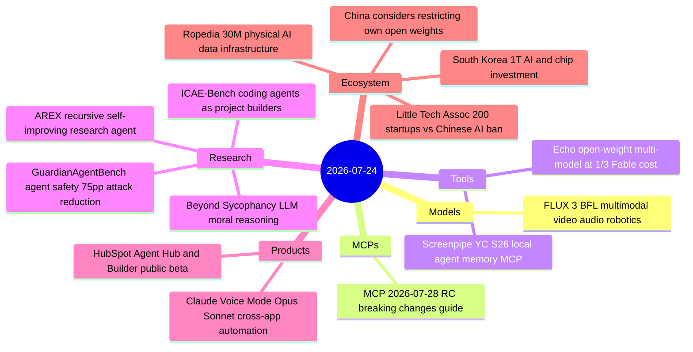

# AI Digest — 2026-07-24

> Black Forest Labs released FLUX 3, its first unified multimodal model covering video, image, audio, and robotics action prediction — a pivot from image-only that puts BFL in direct competition with Runway and Sora while simultaneously entering physical AI. The day's biggest policy story is the formation of the Little Tech Association, with nearly 200 startups (including YC and Proton) sending letters to the Trump administration opposing a potential ban on Chinese open-weight AI, as Reuters reports that China is simultaneously weighing restrictions on overseas access to its own open-weight models. On the product side, Anthropic upgraded Claude's voice mode to Opus and Sonnet with cross-app automation, HubSpot launched CRM-native agent orchestration tools in public beta, and four new arXiv papers address recursive self-improving research agents, agent safety benchmarking, and LLM ethical reasoning.

## Day at a glance



## Top stories

1. **FLUX 3: Black Forest Labs goes multimodal and physical** — BFL's first unified model generates video (up to 20s with native audio), images, and robot action predictions from a single architecture; early video evaluation shows 77% preference over Runway Gen-4.5. [→ details](models.md#flux-3)
2. **Little Tech Association: 200 startups push back on Chinese open-weight ban** — An organized coalition including YC and Proton delivered letters to Trump, Lutnick, and Kratsios arguing that blocking Chinese open-weight models would destroy hundreds of startups while enriching Anthropic and OpenAI — landing simultaneously with news that China itself may restrict its own models' overseas distribution. [→ details](ecosystem.md#little-tech-association-letter)
3. **Claude voice mode adds Opus/Sonnet + cross-app automation** — Voice mode now selects the user's last active model (Opus/Sonnet/Haiku) and can trigger actions in Gmail, Google Calendar, Slack, Canva, and Notion; paid subscribers get all models and multi-app access. [→ details](products.md#claude-voice-mode-upgrade)

## By the numbers

| Category   | Items | Highlight |
|------------|------:|-----------|
| Models     |     1 | FLUX 3: video + audio + image + robotics in one model |
| MCPs       |     1 | 2026-07-28 RC: remove initialize handshake, MCP Apps, auth hardening |
| Tools      |     2 | Echo: Fable-level benchmarks at ~1/3 cost via open-weight routing |
| Research   |     4 | AREX recursive agent outperforms comparables on HLE and BrowseComp |
| Products   |     2 | Claude voice: Opus/Sonnet + cross-app in 10 languages |
| Ecosystem  |     4 | 200 startups vs. Chinese AI ban; China may restrict own open weights |

## Timeline (UTC)

```mermaid
timeline
  title Releases and announcements
  Jul 22 : Little Tech Association letter : 200 startups oppose Chinese open-weight ban
  Jul 22 : Reuters : China MOFCOM weighs restricting own AI model exports
  Jul 23 09:00 : Black Forest Labs FLUX 3 launch : video audio image robotics unified model
  Jul 23 13:00 : HubSpot Agent Hub and Builder public beta : CRM agent orchestration
  Jul 23 17:00 : Anthropic Claude voice mode : Opus and Sonnet added : cross-app automation : 10 languages
  Jul 23 : Ropedia closes 30M pre-A : physical AI data infrastructure : Xperience-10M dataset
  Jul 24 : AREX paper 2607.21461 : recursive self-improving research agent
  Jul 24 : GuardianAgentBench 2607.20982 : agent failure modes and guardrails
  Jul 24 : ICAE-Bench 2607.21217 : coding agents as interactive project builders
  Jul 24 : Echo Show HN 373 pts : open-weight multi-model orchestration
  Jul 24 : Screenpipe YC S26 Launch HN : local screen recording agent memory
```

## Files
- [Models](models.md)
- [MCPs](mcps.md)
- [Tools](tools.md)
- [Research](research.md)
- [Products](products.md)
- [Ecosystem](ecosystem.md)
